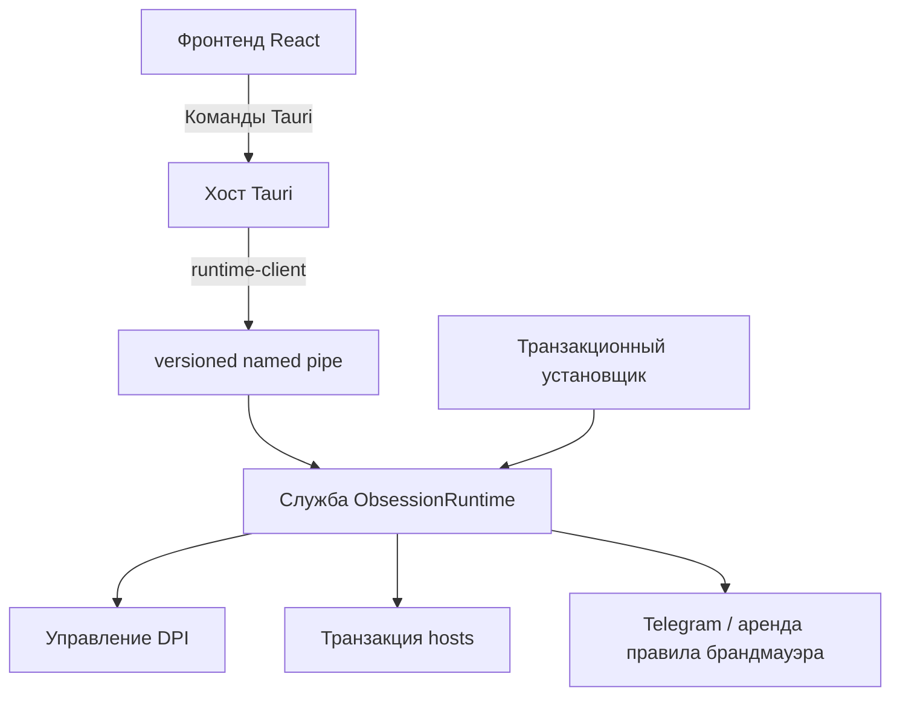

# Obsession — руководство разработчика

Этот каталог содержит настольное приложение Obsession, защищённую Windows-службу, общий IPC-протокол и собственный транзакционный установщик.

Пользовательское описание и ссылка на опубликованный установщик находятся в [корневом README](../README.md).

Актуальные руководства собраны в [указателе документации](docs/README.md).

## Структура проекта

| Каталог | Назначение |
|---|---|
| `src/` | React-интерфейс, состояние Zustand и визуальные сцены тем. |
| `src-tauri/` | Хост Tauri: окно, трей, команды моста фронтенда и управление операциями без повышенных прав. |
| `runtime-protocol/` | Версионированные типы запросов, ответов и событий для IPC. |
| `runtime-client/` | Клиент named pipe с проверкой совместимости и ожиданием занятой службы. |
| `runtime-service/` | Windows-служба для всего компьютера, выполняющая привилегированные операции из разрешённого списка. |
| `runtime-reliability/` | Общая логика проверки и восстановления runtime-состояния. |
| `installer/` | UI и Rust backend фирменного setup размером `720×500`. |
| `scripts/` | Подготовка manifest/resources и сборка setup. |
| `docs/` | Архитектура, диагностика, проверка релиза и скриншоты приложения. |

## Стек

- **Фронтенд:** React 18, TypeScript, Vite 6, Tailwind CSS, Framer Motion, Zustand.
- **Хост приложения:** Tauri 2 и Rust stable.
- **Runtime:** Tokio, Windows API, named pipe IPC, WinDivert/winws и Obsession Telegram Proxy.
- **Графика:** собственные схемы рендеринга WebGL2 и Canvas 2D с резервным SVG/CSS-отображением.
- **Тесты:** Vitest и модульные и интеграционные Rust-тесты для каждого crate.

## Требования

- Windows 10/11 x64.
- Node.js и npm, совместимые с Vite 6; зависимости закреплены в `package-lock.json`.
- Rust stable с набором инструментов MSVC.
- Системные зависимости из [Tauri prerequisites](https://tauri.app/start/prerequisites/).

Установите зависимости приложения и установщика из корня репозитория:

```powershell
npm --prefix ObsessionTauri ci
npm --prefix ObsessionTauri/installer ci
```

## Запуск

Полная сборка Tauri для разработки:

```powershell
npm --prefix ObsessionTauri run tauri dev
```

Vite запускает только фронтенд, но основной `App` ожидает Tauri API. Для изолированной работы над сценами используйте специальные тестовые страницы, например:

```text
http://127.0.0.1:1420/devtools/labs/obsession-choir-dev.html
http://127.0.0.1:1420/devtools/labs/overview-dev.html
```

Все лабораторные страницы собраны в [devtools/labs](devtools/labs/README.md).
Команда `npm run dev:labs` открывает их каталог. В релизную сборку входит только
`index.html`; общие компоненты тем остаются в исходниках приложения.

> [!IMPORTANT]
> Приложение разработки не повышает себя до администратора. DPI, `hosts` и команды брандмауэра доступны только через совместимую установленную службу ObsessionRuntime. При отсутствии нужной возможности операция должна оставаться заблокированной.

Перед запуском сборки разработки выйдите из установленного приложения через трей: защита от второго экземпляра может показать уже открытое окно вместо нового. Браузерное превью обзора использует демонстрационные статусы и не подтверждает работу обхода.

Для бумажного установщика есть отдельное безопасное превью:

```powershell
npm --prefix ObsessionTauri/installer run dev
```

Откройте `http://127.0.0.1:1430/?preview=welcome` или `http://127.0.0.1:1430/?preview=uninstall`. Эти режимы показывают интерфейс без установки и удаления файлов. Papyrus берётся из локальных шрифтов; без него используется резервный шрифт. Файл Papyrus не распространяется в репозитории.

## Проверки

Фронтенд:

```powershell
npm --prefix ObsessionTauri test
npm --prefix ObsessionTauri run build
npm --prefix ObsessionTauri/installer test
npm --prefix ObsessionTauri/installer run build
```

Форматирование Rust и основные crates:

```powershell
cargo fmt --manifest-path ObsessionTauri/src-tauri/Cargo.toml --all -- --check
cargo test --manifest-path ObsessionTauri/src-tauri/Cargo.toml
cargo test --manifest-path ObsessionTauri/runtime-protocol/Cargo.toml
cargo test --manifest-path ObsessionTauri/runtime-client/Cargo.toml
cargo test --manifest-path ObsessionTauri/runtime-service/Cargo.toml
cargo test --manifest-path ObsessionTauri/runtime-reliability/Cargo.toml
cargo test --manifest-path ObsessionTauri/installer/src-tauri/Cargo.toml
cargo test --manifest-path tgproxy-rs/Cargo.toml
```

Конфиги и упаковка:

```powershell
npm --prefix ObsessionTauri run audit:dpi
npm --prefix ObsessionTauri run test:dpi-configs
node --test ObsessionTauri/scripts/discord-speed-variants.test.mjs ObsessionTauri/scripts/payload-compression.test.mjs
npm --prefix ObsessionTauri run verify:dpi-parsers
```

Проверка парсеров запускает поставляемые движки в режиме dry-run. Это проверка синтаксиса, а не доступности сайтов. Сетевые тесты с `--ignored` запускаются отдельно и не нужны для обычного прогона.

## Сборка

Фронтенд для распространения и исполняемый файл Tauri:

```powershell
npm --prefix ObsessionTauri run build
npm --prefix ObsessionTauri run tauri build
```

Фирменный setup:

```powershell
npm --prefix ObsessionTauri run build:setup
```

Результат появляется в `ObsessionTauri/dist-release/`:

```text
Obsession-Setup_<version>_x64.exe
Obsession-Setup_<version>_x64.exe.sha256
```

Setup собирает приложение, службу и проверенные ресурсы runtime в единый сжатый пакет. Размер зависит от ресурсов конкретной сборки. Установленный `uninstall.exe --uninstall` открывает отдельный интерфейс удаления с выбором сохраняемых данных.

Подробнее: [сжатие payload](installer/PAYLOAD_COMPRESSION.md), [границы удаления и проверка в VM](installer/UNINSTALL.md).

## Архитектурные границы



Основные правила:

- фронтенд не передаёт службе произвольные пути исполняемых файлов, URL, домены или команды оболочки;
- версия протокола и возможности проверяются до привилегированных изменений;
- длительные проверки могут занимать единственный pipe, поэтому runtime-client отличает занятую службу от недоступной;
- события прогресса ускоряют отображение, но снимок состояния остаётся источником истины;
- фоновые проверки работоспособности только читают состояние;
- установка `hosts` использует снимок до операции, проверку после записи и полный откат при неожиданном отказе;
- установщик выполняет установку, обновление и восстановление транзакционно и не продолжает обычную повторную попытку после неполного отката.

Подробнее см. [архитектуру защищённого runtime](docs/SECURE_RUNTIME_ARCHITECTURE.md).

## Функциональные области

- `src-tauri/src/dpi.rs` — управление Legacy/Zapret2, конфигурациями и логами.
- `src-tauri/src/legacy_reliability/` — наблюдение, проверка условий окружения и подтверждение стратегий Legacy.
- `src-tauri/src/adaptive_strategy/` — генерация, проверка и кэш Zapret2-кандидатов.
- `src-tauri/src/hosts.rs` — интерфейс защищённых операций hosts для фронтенда.
- `src-tauri/src/onboarding.rs` — совместимость с журналами прежнего мастера: проверка и откат незавершённых настроек. Приложение сразу открывает «Обзор»; приветственный мастер больше не показывается.
- `src-tauri/src/proxy.rs` — Obsession Telegram Proxy и клиент аренды доступа LAN.
- `src/design/components/obsessionChoir/` — геометрия, движение и схема WebGL Black Choir.
- `src/store/` — состояние экранов и синхронизация снимков с интерфейсом.

## Ресурсы и безопасность сборки

winws, WinDivert, Obsession Telegram Proxy, конфигурации и списки находятся в `src-tauri/resources/`. Скрипт подготовки создаёт манифест с хешами, а установщик размещает пакет в `%ProgramFiles%\Obsession`.

Не добавляйте во фронтенд обходные пути для прямой записи системных файлов или запуска произвольных процессов. Для новой привилегированной возможности нужны отдельный тип протокола, проверка backend, объявление возможности и тесты отказа.

## Документация

- [Архитектура защищённого runtime](docs/SECURE_RUNTIME_ARCHITECTURE.md)
- [Как работает автообход](docs/AUTO_BYPASS.md)
- [Диагностика и конфигурации DPI](docs/DIAGNOSTICS.md)
- [Проверка перед выпуском](docs/RELEASE_CHECKLIST.md)
- [Удаление приложения](installer/UNINSTALL.md)

Автор интерфейса и проекта: **AcediaWhy**.
