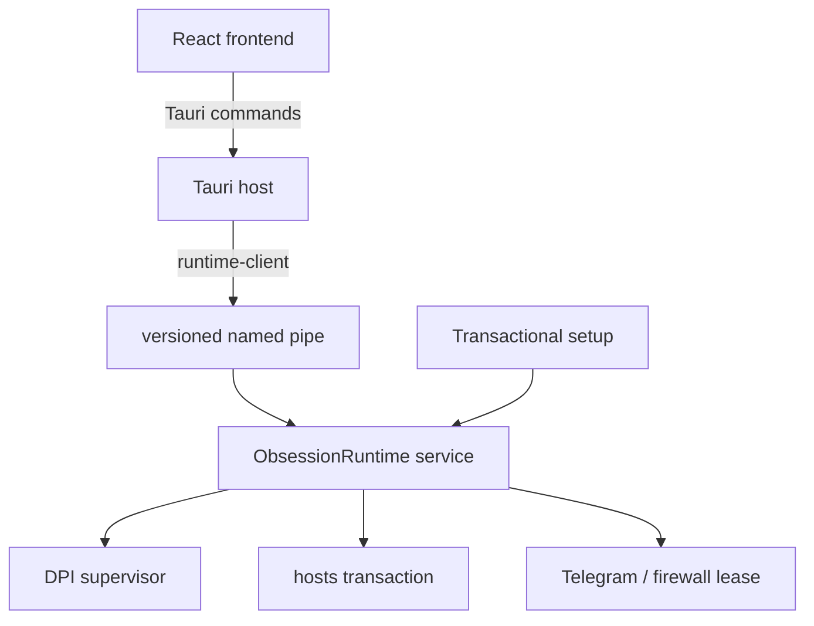

# Obsession — руководство разработчика

Этот каталог содержит desktop-приложение Obsession, защищённую Windows-службу, общий IPC-протокол и фирменный transactional setup.

Пользовательское описание и ссылка на опубликованный установщик находятся в [корневом README](../README.md).

## Workspace

| Каталог | Назначение |
|---|---|
| `src/` | React-интерфейс, Zustand stores, onboarding и визуальные сцены тем. |
| `src-tauri/` | Tauri host: окно, трей, команды frontend-моста и непривилегированная orchestration-логика. |
| `runtime-protocol/` | Версионированные request/response/event типы для IPC. |
| `runtime-client/` | Клиент named pipe с проверкой совместимости и ожиданием занятой службы. |
| `runtime-service/` | Machine-wide Windows service, выполняющая allowlisted привилегированные операции. |
| `runtime-reliability/` | Общая логика проверки и восстановления runtime-состояния. |
| `installer/` | UI и Rust backend фирменного setup размером `720×500`. |
| `scripts/` | Подготовка manifest/resources и сборка setup. |
| `docs/` | Спецификации runtime, onboarding и темы Obsession. |

## Стек

- **Frontend:** React 18, TypeScript, Vite 6, Tailwind CSS, Framer Motion, Zustand.
- **Desktop host:** Tauri 2 и Rust stable.
- **Runtime:** Tokio, Windows API, named pipe IPC, WinDivert/winws и Obsession Telegram Proxy.
- **Графика:** собственные WebGL2 и Canvas 2D pipelines с SVG/CSS fallback.
- **Тесты:** Vitest и Rust unit/integration tests для каждого crate.

## Требования

- Windows 10/11 x64.
- Node.js и npm, совместимые с Vite 6; зависимости закреплены в `package-lock.json`.
- Rust stable с MSVC toolchain.
- Системные зависимости из [Tauri prerequisites](https://tauri.app/start/prerequisites/).

Установите зависимости приложения и установщика из корня репозитория:

```powershell
npm --prefix ObsessionTauri ci
npm --prefix ObsessionTauri/installer ci
```

## Запуск

Полный Tauri dev build:

```powershell
npm --prefix ObsessionTauri run tauri dev
```

Только Vite поднимает frontend, но основной `App` ожидает Tauri API. Для изолированной работы над сценами используйте специальные harness-страницы, например:

```text
http://127.0.0.1:1420/obsession-choir-dev.html
http://127.0.0.1:1420/overview-dev.html
```

> [!IMPORTANT]
> Dev-приложение не повышает себя до администратора. DPI, `hosts` и firewall-команды доступны только через совместимую установленную службу ObsessionRuntime. Отсутствующая capability должна оставаться fail-closed.

Перед запуском dev-сборки выйдите из установленного приложения через трей: защита от второго экземпляра может показать уже открытое окно вместо нового. Браузерное превью обзора использует демонстрационные статусы и не подтверждает работу обхода.

Для бумажного установщика есть отдельное безопасное превью:

```powershell
npm --prefix ObsessionTauri/installer run dev
```

Откройте `http://127.0.0.1:1430/?preview=welcome` или `http://127.0.0.1:1430/?preview=uninstall`. Эти режимы показывают интерфейс без установки и удаления файлов. Papyrus берётся из локальных шрифтов; без него используется резервный шрифт. Файл Papyrus не распространяется в репозитории.

## Проверки

Frontend:

```powershell
npm --prefix ObsessionTauri test
npm --prefix ObsessionTauri run build
npm --prefix ObsessionTauri/installer test
npm --prefix ObsessionTauri/installer run build
```

Rust formatting и основные crates:

```powershell
cargo fmt --manifest-path ObsessionTauri/src-tauri/Cargo.toml --all -- --check
cargo test --manifest-path ObsessionTauri/src-tauri/Cargo.toml
cargo test --manifest-path ObsessionTauri/runtime-protocol/Cargo.toml
cargo test --manifest-path ObsessionTauri/runtime-client/Cargo.toml
cargo test --manifest-path ObsessionTauri/runtime-service/Cargo.toml
cargo test --manifest-path ObsessionTauri/runtime-reliability/Cargo.toml
cargo test --manifest-path ObsessionTauri/installer/src-tauri/Cargo.toml
cargo test --manifest-path tgproxy-rs/Cargo.toml
```

Конфиги и упаковка:

```powershell
npm --prefix ObsessionTauri run audit:dpi
npm --prefix ObsessionTauri run test:dpi-configs
node --test ObsessionTauri/scripts/discord-speed-variants.test.mjs ObsessionTauri/scripts/payload-compression.test.mjs
npm --prefix ObsessionTauri run verify:dpi-parsers
```

Проверка парсеров запускает поставляемые движки в режиме dry-run. Это проверка синтаксиса, а не доступности сайтов. Сетевые тесты с `--ignored` запускаются отдельно и не нужны для обычного прогона.

## Сборка

Production frontend и Tauri binary:

```powershell
npm --prefix ObsessionTauri run build
npm --prefix ObsessionTauri run tauri build
```

Фирменный setup:

```powershell
npm --prefix ObsessionTauri run build:setup
```

Результат появляется в `ObsessionTauri/dist-release/`:

```text
Obsession-Setup_<version>_x64.exe
Obsession-Setup_<version>_x64.exe.sha256
```

Setup собирает приложение, службу и проверенные runtime-ресурсы в единый сжатый payload. Размер зависит от ресурсов конкретной сборки. Установленный `uninstall.exe --uninstall` открывает отдельный интерфейс удаления с выбором сохраняемых данных.

Подробнее: [сжатие payload](installer/PAYLOAD_COMPRESSION.md), [бумажный интерфейс](installer/PAPER_PREVIEW.md), [границы удаления и проверка в VM](installer/UNINSTALL.md).

## Архитектурные границы



Основные правила:

- frontend не передаёт службе произвольные executable paths, URL, домены или команды оболочки;
- protocol version и capabilities проверяются до privileged mutation;
- длительные проверки могут занимать единственный pipe, поэтому runtime-client отличает занятую службу от недоступной;
- progress events ускоряют UI, но snapshot остаётся источником истины;
- фоновые health checks являются read-only;
- установка `hosts` использует pre-operation snapshot, post-write verification и полный rollback при неожиданном отказе;
- setup выполняет install/update/repair транзакционно и не продолжает обычный retry после неполного rollback.

Подробнее см. [SECURE_RUNTIME_ARCHITECTURE.md](docs/SECURE_RUNTIME_ARCHITECTURE.md) и [ONBOARDING_OVERHAUL_SPEC.md](docs/ONBOARDING_OVERHAUL_SPEC.md).

## Функциональные области

- `src-tauri/src/dpi.rs` — управление Legacy/Zapret2, конфигурациями и логами.
- `src-tauri/src/legacy_reliability/` — наблюдение, environment gate и подтверждение Legacy-стратегий.
- `src-tauri/src/adaptive_strategy/` — генерация, проверка и кэш Zapret2-кандидатов.
- `src-tauri/src/hosts.rs` — frontend-facing façade для protected hosts runtime.
- `src-tauri/src/onboarding.rs` — durable plan/apply/verify/rollback flow.
- `src-tauri/src/proxy.rs` — Obsession Telegram Proxy и LAN lease client.
- `src/design/components/obsessionChoir/` — Black Choir geometry, motion и WebGL pipeline.
- `src/store/` — состояние экранов и синхронизация snapshot с UI.

## Ресурсы и безопасность сборки

winws, WinDivert, Obsession Telegram Proxy, конфигурации и списки находятся в `src-tauri/resources/`. Скрипт подготовки создаёт manifest с хешами, а setup устанавливает payload в `%ProgramFiles%\Obsession`.

Не добавляйте в frontend обходные пути для прямой записи системных файлов или запуска произвольных процессов. Если требуется новая привилегированная возможность, она должна получить отдельный тип протокола, backend-валидацию, capability и тесты отказа.

## Документация

- [Protected runtime architecture](docs/SECURE_RUNTIME_ARCHITECTURE.md)
- [Onboarding V2 specification](docs/ONBOARDING_OVERHAUL_SPEC.md)
- [Obsession theme specification](docs/OBSESSION_THEME_SPEC.md)
- [Legacy: один процесс для выбранных категорий](docs/LEGACY_SINGLE_PROCESS_2026-09-22.md)
- [Восстановление TCP timestamps](docs/LEGACY_TCP_TIMESTAMPS_2026-09-22.md)
- [Диагностика и частичные результаты](docs/LEGACY_TEST_REPORTS_2026-09-22.md)
- [Экспериментальные Discord-конфиги](docs/DISCORD_SPEED_CANDIDATES_2026-09-22.md)

Автор интерфейса и проекта: **AcediaWhy**.
