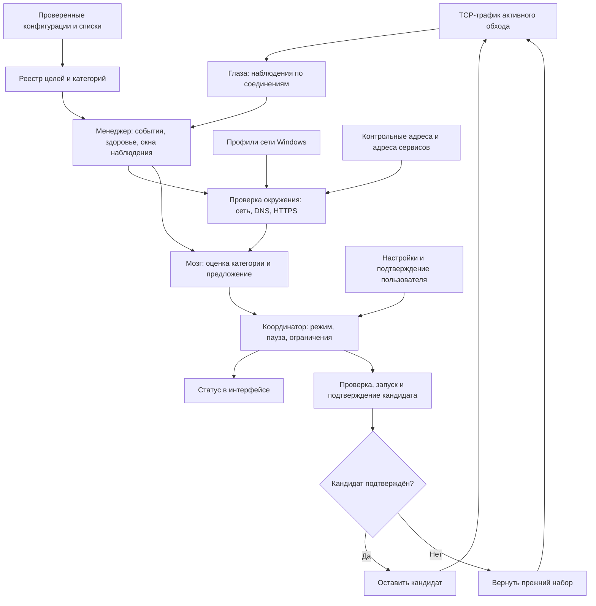
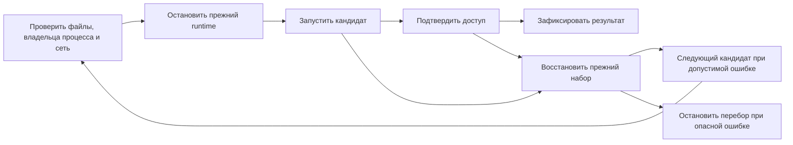

# Как работает автообход: глаза, сеть и мозг

У Obsession есть несколько способов подобрать и поддерживать конфигурацию обхода. Автоподбор ищет подходящий вариант по запросу пользователя. Фоновый контроль доступа наблюдает за уже работающим Legacy и решает, требуется ли восстановление. Адаптивный поиск Zapret2 строит кандидатов из разрешённых параметров движка.

Этот документ объясняет устройство этих механизмов в версии 1.1.0. Основная часть посвящена фоновому контролю Legacy: именно здесь связаны «глаза», оценка сети и «мозг». Названия обозначают обычные программные компоненты. Решения принимают машины состояний с явными условиями и ограничениями; языковая модель или обучаемая нейросеть в этом процессе не участвует.

## Содержание

- [Три разных задачи](#три-разных-задачи)
- [Общая схема](#общая-схема)
- [Глаза: что видно в трафике](#глаза-что-видно-в-трафике)
- [Как событие относится к категории](#как-событие-относится-к-категории)
- [Надёжность наблюдения](#надёжность-наблюдения)
- [Сеть и проверка окружения](#сеть-и-проверка-окружения)
- [Активная проверка сервисов](#активная-проверка-сервисов)
- [Мозг: оценка и решение](#мозг-оценка-и-решение)
- [Режимы управления](#режимы-управления)
- [Замена конфигурации и откат](#замена-конфигурации-и-откат)
- [Защита от устаревших событий](#защита-от-устаревших-событий)
- [Память и ограничения перебора](#память-и-ограничения-перебора)
- [Автоподбор Legacy](#автоподбор-legacy)
- [Адаптивный поиск Zapret2](#адаптивный-поиск-zapret2)
- [Примеры поведения](#примеры-поведения)
- [Что система не подтверждает](#что-система-не-подтверждает)
- [Где читать код](#где-читать-код)

## Три разных задачи

| Механизм | Когда используется | Что меняет | Как принимает результат |
| --- | --- | --- | --- |
| Автоподбор Legacy | Пользователь запускает поиск при выключенном обходе | По очереди запускает временные конфигурации, выбирает прошедшую тест | Все обязательные HTTPS-проверки категории должны пройти |
| Контроль доступа Legacy | Включено наблюдение за действующим обходом | Сообщает о проблеме, предлагает замену или выполняет её — в зависимости от режима | Оценивает события, окружение и свежие результаты; кандидат проходит отдельное подтверждение |
| Адаптивный поиск Zapret2 | Включена соответствующая настройка, Zapret2 активен, пользователь запускает поиск | Временно заменяет параметры выбранной категории | Проверяет серию запросов, состояние кандидата и условия сохранения; при неудаче возвращает прежний набор |

Результат ручного теста не является разрешением на произвольные будущие переключения. У каждого механизма собственные условия запуска и подтверждения.

## Общая схема

В релизной установке процессами DPI и наблюдением Legacy владеет служба `ObsessionRuntime`. Интерфейс передаёт ей типизированные команды и получает снимки состояния. Он не передаёт произвольную командную строку или путь к исполняемому файлу.

У наблюдения и исполнения разные обязанности. Глаза не переключают конфигурации. Оценка окружения не запускает процессы. Мозг формирует намерение, а координатор и исполнитель проверяют, можно ли его выполнить сейчас.

[Подробнее о службе и границах привилегий](SECURE_RUNTIME_ARCHITECTURE.md).

## Глаза: что видно в трафике

Глаза получают копии TCP-пакетов через WinDivert. Захват использует режимы `SNIFF`, `RECV_ONLY` и `NO_INSTALL`: этот наблюдатель не выполняет обход и не отправляет пакеты обратно в сеть. Сам обход делает движок DPI.

Для Legacy фильтр наблюдения строится из TCP-портов действующих конфигураций. Диапазоны объединяются без разворачивания каждого порта в отдельное правило. Пустой план не превращается в наблюдение за всем трафиком.

Парсер разбирает IP и TCP, восстанавливает начало TLS-потока по номерам последовательности и ищет имя сервера — SNI — в ClientHello. Для положительного сигнала Legacy применяется строгий режим: нужен корректный ServerHello или непустая TLS-запись с данными. Произвольные входящие байты не объявляются успехом.

| Наблюдение | Что произошло | Как его следует понимать |
| --- | --- | --- |
| `Working` | Получен допустимый TLS-ответ или данные | Этот этап соединения прошёл; это ещё не проверка всех функций приложения |
| `Reset` | Пришёл входящий TCP RST | Соединение сброшено; причина устанавливается выше по цепочке |
| `Blackhole` после ClientHello | Ответ не появился в отведённое время | Подозрительное молчание TLS-потока; требуется сопоставление с другими данными |
| `Blackhole` на этапе SYN | TCP-рукопожатие не завершилось | Диагностический транспортный сбой, который сам по себе не доказывает DPI |

Один поток не превращается в десятки независимых подтверждений из-за повторных пакетов. Наблюдения имеют идентификаторы потоков, а оценка считает уникальные соединения и цели.

Исходящие fake-пакеты движка отсекаются эвристиками: учитываются слишком низкий TTL, большой спад TTL относительно исходного потока и номер последовательности далеко за реальным окном. Это помогает не принять собственную инъекцию обхода за настоящий запрос клиента. Такой фильтр не является универсальным распознавателем любого искусственного пакета.

Порог молчания после ClientHello — 8 секунд. В Legacy перед доставкой timeout-вердикта добавляется 2 секунды, чтобы уже захваченный поздний ответ успел отменить ложное срабатывание. Эти интервалы описывают работу наблюдателя, а не гарантированное время восстановления сервиса.

## Как событие относится к категории

Один IP-адрес может обслуживать несколько сайтов, а одинаковый домен может встречаться в нескольких конфигурациях. Поэтому система использует `TargetRegistry`: реестр, построенный из проверенных конфигураций и связанных с ними списков.

Реестр учитывает активный выбор, списки включения и исключения, границы доменных суффиксов, TCP-порты и отпечатки содержимого конфигураций. Например, правило `youtube.com` относится к `www.youtube.com`, но не к `notyoutube.com` или `youtube.com.example`.

Если цель однозначно принадлежит активной категории, событие получает её имя и поколение. Неоднозначные, исключённые и неизвестные цели остаются диагностикой и не получают права влиять на выбор стратегии.

Особый случай — соединение, оборвавшееся до появления SNI. Угадывать сервис только по IP общего CDN нельзя. Такое наблюдение обычно остаётся диагностическим. Для поддерживаемых процессов Discord служба дополнительно сопоставляет PID с точной записью исходящего TCP-сокета Windows. Эта подсказка относится к конкретному соединению, а не ко всему IP-адресу. Сейчас такая корреляция процессов реализована для вариантов клиента Discord; она не означает распознавание всех приложений и вкладок браузера.

Перед заменой также проверяется, есть ли у кандидата цели, которые можно отнести к выбранной категории без неоднозначности. Кандидат без таких целей не проходит подготовку восстановления.

## Надёжность наблюдения

Система следит не только за соединениями, но и за состоянием глаз. Если наблюдатель потерял часть событий, отсутствие ответа нельзя считать полноценным доказательством блокировки.

Данные проходят через ограниченные очереди. У поточных событий и служебных сообщений отдельные каналы: поток пакетов не должен вытеснить уведомление о сбое наблюдения. Переполнение учитывается отдельными атомарными счётчиками, поэтому потерянное событие не может одновременно скрыть факт своей потери.

| Состояние глаз | Значение |
| --- | --- |
| `Starting` | Наблюдение запускается |
| `Ready` | Наблюдения пригодны для оценки при отсутствии разрыва в нужном окне |
| `Degraded` | Есть ошибки разбора или потери данных |
| `Blind` | Надёжное наблюдение недоступно |

При потере данных публикуется разрыв наблюдения — `Gap`. Оценки, которые пересекаются с этим разрывом, теряют достоверность. После ошибок нужен чистый интервал в 10 секунд, прежде чем состояние может вернуться в `Ready`. Терминальная ошибка захвата требует нового запуска наблюдателя.

Основные пределы текущей реализации: до 4096 отслеживаемых потоков, очередь захваченных пакетов на 4096 элементов, очередь событий потоков на 1024 и отдельная очередь управления на 64. На категорию хранится до 2048 элементов истории оценки. Это пределы ресурсов, а не целевые значения загрузки.

## Сеть и проверка окружения

Система должна отличать сбой сервиса от общей потери подключения. Перебирать конфигурации, когда отключился Wi-Fi или перестал отвечать DNS, обычно бессмысленно.

### Две сетевые идентичности

В проекте есть два разных способа описать сеть:

| Источник | Назначение | Какие данные используются |
| --- | --- | --- |
| Служба: `network_identity.rs` | Проверить, что восстановление относится к той же сети | Подключённые профили Windows Network List Manager; их GUID сортируются и хешируются |
| Приложение: `netid.rs` | Показать провайдера и найти пользовательский сетевой кэш | Шлюз и его MAC, при недоступности MAC — запасной ключ; ASN и регион через `ipinfo.io` |

Отпечаток службы не является публичным IP, именем Wi-Fi или оценкой провайдера. Это локальный ключ набора сетевых профилей. Служба получает его через Windows API без запуска PowerShell, `route` или `arp`.

Признаки подключения и доступа в интернет в службе основаны на данных Windows. Поля маршрута и доступности шлюза сейчас используют состояние подключённости; отдельного пинга шлюза этот компонент не выполняет. Поэтому локальный снимок дополняется реальными сетевыми запросами.

Если сетевую идентичность нельзя получить или подтвердить как стабильную, восстановление не получает разрешение на смену конфигурации. При изменении отпечатка уже подготовленное действие для прежней сети отклоняется.

### Environment Gate

`Environment Gate` — проверка окружения перед оценкой возможной блокировки. Она рассматривает локальный снимок, здоровье глаз, накопленные наблюдения и ответы HTTPS-адресов.

Контрольные адреса текущей версии:

- `https://cp.cloudflare.com/generate_204`
- `https://detectportal.firefox.com/success.txt`
- `https://captive.apple.com/hotspot-detect.html`

Для оценки общей связности требуется кворум из двух контрольных ответов. Эти адреса не являются безусловно доступными в любой сети: если их тоже фильтруют, система ограничивает выводы, вместо того чтобы объявлять виноватой конфигурацию сервиса.

Одновременно проверяется не более двух адресов выбранной категории. Запросы выполняются параллельно: таймаут одного адреса — 5 секунд, общий срок раунда — 6 секунд, срок актуальности обычного отчёта Gate — 10 секунд.

Оценка проходит несколько проверок по порядку: достоверен ли наблюдатель, есть ли локальное подключение, работает ли DNS контрольных адресов, получены ли их HTTP-ответы, что произошло с адресами категории. Ответ HTTP 4xx может доказывать достижимость сервера, но не работу функции сервиса. HTTP 5xx не превращается в доказательство DPI.

Система также хранит в памяти обычную задержку ответов контрольных адресов для текущей сети. Используется медиана последних подходящих измерений; подозрительные раунды не должны обучать собственную норму. Замедление цели оценивается относительно этой сетевой нормы: порог равен большему из `3 × обычная задержка` и `обычная задержка + 1500 мс`. Без надёжной нормы нельзя уверенно отличить медленную сеть от замедления отдельного сервиса. Образцы живут до 24 часов и не записываются на диск.

## Активная проверка сервисов

Пассивных событий может быть мало: пользователь не открывал сайт, клиент ещё не отправил нужный запрос или соединение не попало в пригодную для оценки область. Поэтому служба выполняет и фоновые активные проверки.

Первый диагностический раунд планируется через 15 секунд после запуска менеджера. После завершения раунда следующая проверка планируется ещё через 15 секунд. Категории обходятся по очереди, а проверки по накопленным подозрительным событиям имеют приоритет. Если подходящего диагностического запроса нет, повтор планируется через 60 секунд. Это не обещание опрашивать каждую категорию ровно раз в 15 секунд.

Для Discord предпочтительны `updates.discord.com` и `discord.com`. Проверяется документ обновления с параметрами Windows x64 и gateway API. Требуется корректный JSON с ожидаемыми полями: успешный TLS, пустой ответ или HTML-заглушка не заменяют проверку сервиса.

Для YouTube / Twitch предпочтительны `www.youtube.com` и `www.twitch.tv`, если они входят в область активной конфигурации. Произвольный технический домен из списка обхода не должен подменять проверку основного сайта. Если предпочтительных целей в области нет, общий механизм может выбрать другие разрешённые адреса; специальное правило повторных сбоев видео применяется только к известным адресам самих сервисов.

В общем HTTPS-запросе проверяется получение тела ответа с ограничением объёма. Одних заголовков HTTP 200 недостаточно, если чтение ответа зависло. Для Discord документ проверяется целиком в пределах допустимого размера.

### Почему «Доступ не подтверждён» не отключает восстановление

Одна неудачная проверка не доказывает, что весь YouTube или Twitch не работает. Поэтому интерфейс показывает «Доступ не подтверждён». При этом система продолжает оценивать последующие результаты.

Для известных адресов Discord и YouTube / Twitch два последовательных подходящих раунда могут сформировать `DpiSuspected` без пассивного кворума. Должны одновременно выполняться условия:

- DNS для проблемной цели уже прошёл; сбой произошёл в транспорте или при чтении ответа HTTP 200.
- Хотя бы одна и та же проблемная цель присутствует в обеих сериях. Чередование несвязанных сбоев разных сайтов не складывается в одно доказательство.
- Минимум два контрольных адреса доступны.
- Глаза находятся в `Ready`, отпечаток сети стабилен.
- Совпадают сеанс, поколение категории, поколение наблюдателя, версия реестра и сеть.
- Второй отчёт действительно новее первого, а срок актуальности предыдущего не истёк.

Диагностическая запись живёт до 120 секунд. Успех, смена контекста, истечение срока или неподходящая ошибка сбрасывают накопленную серию. DNS-ошибки и HTTP 4xx/5xx сами по себе эту ветку восстановления не запускают.

Так система избегает двух крайностей: одного запроса недостаточно для переключения, но устойчивый подходящий сбой не остаётся навсегда просто неопределённым статусом.

## Мозг: оценка и решение

Менеджер собирает события отдельно для каждой активной категории — в коде такая область называется `lane`. Для обычных наблюдений используется окно 30 секунд. Для TCP Reset Discord окно увеличено до 90 секунд: повторные попытки обновляющего клиента могут идти редко.

Обычный кворум сбросов — три разных потока к двум целям. Для Discord проверка окружения может запускаться уже после двух потоков к одной цели. Для TLS-молчания проверка Gate может начаться после двух потоков к одной цели, но сильный общий кворум требует двух целей. Порог запуска проверки и достаточность данных для действия — разные условия.

Успешные соединения тоже считаются по отдельным потокам и целям. Смена оценки имеет задержки и условия сброса, чтобы соседние события не заставляли статус постоянно прыгать. Для Discord служба дополнительно не выдаёт успешное TLS-рукопожатие за здоровье приложения: положительная оценка сервиса опирается на активные проверки его документов.

| Оценка | Что означает для принятия решения |
| --- | --- |
| `AwaitingEvidence` | Пока недостаточно данных |
| `Working` | Подходящие проверки или наблюдения подтвердили доступ в своей области |
| `DpiSuspected` | Согласованные признаки позволяют рассмотреть другую конфигурацию |
| `DpiBlocked` | Выполнены более сильные условия модели, включая соответствующие наблюдения и проверку окружения |
| `Offline` | Нет подтверждённого подключения |
| `DnsFailure` | Не набран кворум DNS контрольных адресов |
| `UpstreamDegraded` | Общая связность не подтверждена контрольными ответами |
| `TargetUnavailable` | Проверенные адреса не дали достаточного подтверждения доступа |
| `ServiceSlow` | Ответ заметно медленнее подходящей нормы |
| `SensorUnreliable` | Наблюдениям нельзя доверять |

`DpiSuspected` и `DpiBlocked` — классификации модели по доступным данным, а не определение причины любой сетевой ошибки со стопроцентной точностью. Кандидат всё равно должен пройти подтверждение.

Чистая политика `ObserveOnlyBrain` возвращает одно из намерений: ждать, предложить замену категории или временно сохранить её конфигурацию без дальнейшего перебора. Она сама ничего не исполняет. Общий сбой сети или ненадёжность наблюдения в одной категории может подавить предложение сменить другую.

## Режимы управления

По умолчанию наблюдение Legacy включено, режим — «Только наблюдение». Автоматическая смена конфигураций требует явного выбора соответствующего режима.

| Режим | Поведение |
| --- | --- |
| Только наблюдение | Оценки и предполагаемое действие показываются пользователю; координатор не запускает замену |
| С подтверждением | Служба создаёт предложение для конкретного инцидента и кандидата; запуск требует подтверждения пользователя |
| Автоматически | Координатор может начать ограниченную попытку восстановления, если выполнены условия и нет паузы или запрета категории |

Предложение с подтверждением действует 30 секунд. Подтверждение содержит ID предложения и попытки. Служба проверяет срок и актуальность контекста заново; нажатие старой кнопки не разрешает замену в новом сеансе.

Пауза автоматического режима запрещает новые автоматические попытки. Заморозка категории сохраняет её выбор и блокирует восстановление для неё. Это не команда выключить трафик категории. Выключение самого наблюдения управляет жизненным циклом глаз и менеджера.

Изменение режима или отмена предложения не должно бросать уже начатую транзакцию между остановкой и запуском. Она должна закончиться безопасным результатом: подтверждением, откатом либо явной ошибкой. Новые настройки проверяются при подготовке последующих действий.

## Замена конфигурации и откат

Восстановление проходит через отдельную машину состояний.

### Подготовка

До остановки проверяются действующий сеанс, выбранная категория, стабильность сети, версия реестра, отпечатки конфигураций, ресурсы защищённого каталога и владелец процесса. Служба готовит оба плана: прежний и предполагаемый новый.

При нескольких категориях Legacy работает один объединённый процесс `winws`. Логическая замена затрагивает конфигурацию одной категории, но технически перезапускается общий процесс. Выбор соседних категорий сохраняется; короткий перерыв может затронуть весь объединённый обход. Telegram-прокси не является частью этой транзакции Legacy.

### Подтверждение кандидата

Факт запуска процесса ещё не означает, что обход работает. После готовности кандидата создаётся новая граница наблюдения. Данные прежнего процесса не должны подтвердить новый.

Окно подтверждения — 20 секунд, с дополнительным интервалом доставки до 2 секунд. Исполнитель сопоставляет ограниченные HTTPS-пробы и новые `Working`-наблюдения по целям и времени. Для двух целей требуется соответствующее подтверждение обеих; для единственной цели — два разных запроса и два разных потока. После набора кворума нужен чистый интервал без необработанных неблагоприятных событий: сейчас он составляет 10,5 секунды.

Для Discord предусмотрено уточнение: пригодные новые TLS-события настоящего клиента могут учитываться, даже если синтетический запрос не сработал из-за различия TLS-профиля. Неудачные синтетические запросы без пригодного подтверждения от клиента не считаются успехом.

Разрыв наблюдения, смена контекста, поломка процесса или недостаточное подтверждение не позволяют зафиксировать кандидат. После подтверждённого применения приложение сверяет снимок службы и сохраняет новый выбор в пользовательских настройках. Ошибка сохранения настроек выводится отдельно: действующее состояние службы и запись на диске — разные вещи.

### Возврат

При неподтверждённом кандидате исполнитель возвращает подготовленный прежний набор. В автоматическом режиме следующий кандидат допускается только после безопасного возврата и новой подготовки.

Не каждая ошибка означает плохую стратегию. Сбой самого наблюдателя, изменение защищённых ресурсов, потеря владельца процесса или невозможность восстановить прежний runtime могут остановить перебор и потребовать вмешательства. Система не должна маскировать такой результат как обычный неудачный тест следующего файла.

## Защита от устаревших событий

Сетевые запросы, захват пакетов и перезапуски выполняются асинхронно. Ответ может прийти уже после смены стратегии. Поэтому событие или действие связано с несколькими идентификаторами:

| Идентификатор | Для чего нужен |
| --- | --- |
| Сеанс | Отделяет разные запуски обхода |
| Поколение runtime | Привязывает остановку и замену к действующему набору процессов |
| Поколение категории | Не смешивает прежнюю и новую конфигурации категории |
| Поколение глаз | Отделяет данные разных запусков наблюдателя |
| Версия реестра | Привязывает цель к актуальному составу конфигураций и списков |
| Отпечаток сети | Не переносит решение в другую сеть |
| ID инцидента и попытки | Не превращает повторный снимок в новую команду восстановления |
| PID и идентичность запуска процесса | Защищает от повторного использования PID и остановки постороннего процесса |

В коде связка актуальных идентификаторов называется `fence`. Перед действиями она сравнивается повторно. Во время подтверждения дополнительно учитываются порядок событий, временные границы и здоровье наблюдения.

Практический пример: пользователь остановил обход, запустил его заново, а старый HTTPS-запрос завершился успешно. Этот ответ относится к прежней попытке и не может подтвердить новый кандидат или разрешить остановку нового процесса.

## Память и ограничения перебора

Память разных механизмов не следует объединять в один «обученный мозг».

| Что хранится | Где и зачем |
| --- | --- |
| Выбранные конфигурации и режимы | В пользовательских настройках; отражают выбор пользователя и подтверждённый результат |
| Последний успешный вариант для пользовательской сети | В кэше приложения; задаёт приоритет обычного автоподбора, но не заменяет тест |
| Инциденты, временные запреты кандидатов, диагностические серии | В памяти контура Legacy службы; предотвращают повторную обработку и частый перебор |
| Норма задержки Gate | В памяти менеджера; используется только с подходящей стабильной сетью |
| Подтверждённые адаптивные кандидаты Zapret2 | В отдельном кэше приложения с версией движка, схемой и отпечатком области применения |

В текущем служебном контуре Legacy нет подключения отдельного долговременного доверительного кэша из `legacy_reliability/cache.rs`. Наличие этого модуля в исходниках не означает, что служба восстанавливает из него рейтинг после перезапуска. То же относится к раннему модулю `brain/`: он не является исполнителем релизного контроля Legacy.

Координатор Legacy удаляет дубли кандидатов по отпечатку содержимого, исключает текущую конфигурацию и временно не предлагает варианты с подходящим отрицательным результатом для той же сети и категории. В автоматической цепочке допускается до 16 кандидатов. Отрицательный результат стратегии или готовности процесса может поставить её на паузу на 5 минут; ошибки окружения и безопасности обрабатываются отдельно.

После автоматической цепочки действует ограничение частоты в 30 секунд. Это не обязательная пауза между каждым соседним кандидатом внутри одной цепочки. Повторный снимок уже обработанного инцидента не запускает ещё одну такую цепочку.

## Автоподбор Legacy

Обычный автоподбор можно использовать независимо от фонового восстановления. Он запускается при выключенном обходе, чтобы временный тест не заменял работающий пользовательский сеанс.

Порядок кандидатов для каждой категории:

1. Ранее успешная конфигурация текущей сети, если она ещё доступна.
2. Текущий выбор пользователя.
3. Остальные доступные конфигурации без повторов.

Конфигурации проверяются последовательно, поскольку они меняют действующий набор DPI. Адреса внутри одной конфигурации проверяются параллельно. На сетевой этап отводится до 15 секунд с повторными попытками; запуск, ожидание готовности и остановка идут отдельно.

В автоподборе окончательная ошибка любого обязательного адреса завершает проверку кандидата раньше. Ручной тест продолжает собирать результаты остальных адресов до общего срока. Перед сменой конфигурации оставшиеся сетевые задачи отменяются и завершаются, затем останавливается именно поколение тестового процесса.

Для Discord проверяются gateway, документ обновления, сайт и публичный аватар CDN; для YouTube / Twitch — сайты сервисов и изображение YouTube CDN. Проверка изображения рассматривает содержимое: HTML вместо картинки не является успехом.

Только полный успех сохраняет рабочий вариант. Частичная проверка, отмена или незавершённый запрос не получают положительную отметку. Для категории без прошедшего кандидата сохраняется прежний выбор. Если не удалось подтвердить остановку временного runtime, автоподбор прерывается.

[Формат результатов и практическая диагностика](DIAGNOSTICS.md#результаты-проверки-dpi).

## Адаптивный поиск Zapret2

Zapret2 использует отдельную модель поиска. Она не меняет конфигурации Legacy и не наследует его разрешения на автоматическое восстановление.

Для поиска требуется активный Zapret2, включённая настройка адаптивного механизма и соответствующая возможность защищённой службы. Пользователь запускает поиск явно. Категории — Discord, YouTube / Twitch и Gaming; у Gaming запуск восстановления дополнительно требует подходящих данных о сбое. Поиск QUIC для Discord не поддерживается этой командой.

Генератор строит конечный набор кандидатов из разрешённых функций, диапазонов и payload. Валидатор отклоняет неподдерживаемые комбинации, компилятор преобразует допустимые параметры, а служба повторно проверяет типизированный запрос и защищённые ресурсы. Произвольный Lua-текст или командная строка из интерфейса не становятся привилегированным запуском.

Последовательность поиска:

1. Определить область и транспорт; для QUIC найти пригодные тестовые цели.
2. Проверить исходный набор и пригодность самих проб.
3. Подготовить ограниченный список различных кандидатов, учитывая подходящий подтверждённый сетевой вариант.
4. По очереди временно запустить кандидат и выполнить серию проверок.
5. Сохранить подтверждённый результат либо вернуть исходный набор.

| Режим поиска | Обычный бюджет кандидатов | Успешные раунды |
| --- | --- | --- |
| Быстрый | До 4 | 2 из 2 |
| Сбалансированный | До 8 | 2 из 3 |
| Глубокий | До 12 | 3 из 4 |

Генератор ограничен 12 кандидатами. Для восстановления уже подтверждённо неисправного Discord бюджет может расширяться до полной допустимой цепочки независимо от выбранного обычного бюджета. Эти числа не задают фиксированное время всего поиска: подготовка, ответы сети и возвраты тоже занимают время.

Если исходный набор проходит проверки, поиск работает как сравнение. Успешный кандидат получает до 60 секунд на проверку пользователем и явное подтверждение. Отказ, отмена или истечение этого окна приводят к возврату прежнего набора. Если исходный набор признан неисправным и поиск идёт в режиме восстановления, прошедший требуемые проверки кандидат может сохраняться сразу в рамках уже запущенного пользователем поиска.

Кэш разделяет подготовленные, рекомендованные и подтверждённые варианты. Повторное применение подтверждённого варианта учитывает сеть, транспорт, версию движка, версию схемы и отпечаток списков. Рекомендация для другой категории не равна результату её собственной проверки.

## Примеры поведения

### YouTube работает, один запрос завершился ошибкой

В интерфейсе может появиться «Доступ не подтверждён». Система не объявляет весь сервис нерабочим по этому запросу. Следующий подходящий успешный раунд сбрасывает серию ошибок. Продолжение работы сайта и просмотр видео всё равно стоит проверять в обычном сценарии пользователя.

### YouTube стабильно не отвечает, остальная сеть работает

Два свежих раунда показывают подходящий транспортный сбой одной и той же известной цели. Контрольные адреса доступны, сеть стабильна, наблюдатель исправен. Оценка может перейти в `DpiSuspected`: в режиме наблюдения это останется предложением; с подтверждением появится ограниченное по времени действие; автоматически начнётся проверяемая попытка замены.

### Пропал интернет или сломался DNS

Локальное состояние или контрольные запросы не проходят проверку. Система показывает проблему подключения или окружения. Это не повод объявлять каждую конфигурацию плохой и перезапускать их одну за другой.

### Наблюдатель перегружен

Есть потери очереди и разрыв данных. Оценка становится недостоверной, подтверждение кандидата не может опираться на пропущенное окно. Система должна дождаться пригодного наблюдения или сообщить о его недоступности.

### Кандидат запустился, но доступ не подтвердился

Готовность процесса прошла, однако нужных новых проверок и наблюдений недостаточно. Кандидат не фиксируется. Выполняется возврат прежнего набора; продолжение автоматической цепочки зависит от причины ошибки и результата возврата.

### Пользователь сменил сеть во время восстановления

Отпечаток больше не соответствует подготовленному действию. Проверка актуальности не разрешает применять решение старой сети в новой. Если транзакция уже изменила runtime, она обрабатывает ситуацию по правилам безопасного завершения и сообщает итог.

## Что система не подтверждает

Успешный ServerHello не гарантирует загрузку страницы; успешная страница не гарантирует каждое видео, голосовой канал или передачу большого файла. Контрольные адреса тоже могут быть недоступны из-за особенностей сети.

Глаза Legacy наблюдают TCP-путь активного плана. Наличие в исходниках типов диагнозов QUIC, UDP или DNS не означает полноценного пассивного контроля этих транспортов в релизном Legacy. При шифровании или отсутствии пригодного SNI возможности отнесения потока к сервису ограничены.

Обход зависит от провайдера, маршрута и поведения самого сервиса. Система может отказаться от автоматического действия при недостатке данных; это осознанный результат правил, а не подтверждение исправности всей сети.

Наблюдатель не расшифровывает содержимое HTTPS-сеансов. Внутри службы обрабатываются сетевые метаданные, нужные для отнесения соединений и оценки. В интерфейс через IPC передаётся ограниченный снимок: категории, оценки, счётчики и состояние восстановления, без сырых пакетов и защищённых путей. Активные пробы обращаются к перечисленным публичным адресам; отдельный запрос `ipinfo.io` используется приложением для определения провайдера и региона.

## Где читать код

Пути ниже ведут к модулям, по которым составлено описание. Чистые части Legacy физически лежат в `src-tauri/src`, но подключаются к `runtime-reliability` и используются службой без зависимости от Tauri.

| Часть | Исходники |
| --- | --- |
| Подключение общих модулей | [runtime-reliability](../runtime-reliability/src/lib.rs), [набор модулей Legacy](../runtime-reliability/src/legacy_reliability.rs) |
| Служебный контур наблюдения и диагностики | [legacy_reliability.rs](../runtime-service/src/legacy_reliability.rs) |
| Захват и сборка потоков | [capture.rs](../src-tauri/src/eyes/capture.rs), [flow.rs](../src-tauri/src/eyes/flow.rs), [parse.rs](../src-tauri/src/eyes/parse.rs), [fake_filter.rs](../src-tauri/src/eyes/fake_filter.rs) |
| Реестр и отнесение событий | [target_registry.rs](../src-tauri/src/legacy_reliability/target_registry.rs), [adapter.rs](../src-tauri/src/legacy_reliability/adapter.rs) |
| Очереди и здоровье глаз | [ingress.rs](../src-tauri/src/legacy_reliability/ingress.rs), [health.rs](../src-tauri/src/legacy_reliability/health.rs) |
| Оценка категории и политика | [assessment.rs](../src-tauri/src/legacy_reliability/assessment.rs), [policy.rs](../src-tauri/src/legacy_reliability/policy.rs), [manager.rs](../src-tauri/src/legacy_reliability/manager.rs) |
| Окружение и проверка документов сервисов | [environment_gate.rs](../src-tauri/src/legacy_reliability/environment_gate.rs), [service_health.rs](../src-tauri/src/service_health.rs) |
| Сетевая идентичность | [служба](../runtime-service/src/network_identity.rs), [приложение](../src-tauri/src/netid.rs) |
| Корреляция процессов Discord и сокетов | [legacy_access_activity.rs](../runtime-service/src/legacy_access_activity.rs) |
| Координатор восстановления | [recovery.rs](../src-tauri/src/legacy_reliability/recovery.rs), [recovery_runtime.rs](../src-tauri/src/legacy_reliability/recovery_runtime.rs) |
| Подготовка и исполнение | [preflight](../runtime-service/src/legacy_recovery_preflight.rs), [транзакция](../runtime-service/src/legacy_recovery_transaction.rs), [эффекты](../runtime-service/src/legacy_recovery_effects.rs), [подтверждение](../runtime-service/src/legacy_confirmation.rs) |
| Мост интерфейса к службе | [protected_runtime.rs](../src-tauri/src/protected_runtime.rs), [LegacyReliabilityPanel](../src/design/components/LegacyReliabilityPanel.tsx) |
| Автоподбор и временный тест | [dpiStore.ts](../src/store/dpiStore.ts), [legacy_test.rs](../src-tauri/src/protected_runtime/legacy_test.rs) |
| Адаптивный Zapret2 | [модель](../src-tauri/src/adaptive_strategy/model.rs), [runtime](../src-tauri/src/adaptive_strategy/runtime.rs), [генератор](../src-tauri/src/adaptive_strategy/generator.rs), [валидатор](../src-tauri/src/adaptive_strategy/validator.rs), [компилятор](../src-tauri/src/adaptive_strategy/compiler.rs), [кэш](../src-tauri/src/adaptive_strategy/cache.rs) |
| Настройки и значения по умолчанию | [settings.rs](../src-tauri/src/settings.rs) |

Модули содержат тесты на повторные и устаревшие события, сетевые ошибки, разрывы наблюдения, отмену, подтверждение кандидатов и возврат прежнего набора. Команды их запуска приведены в [руководстве разработчика](../README.md#тестирование). Проверки на подставных данных полезны для правил и гонок, но поведение конкретного провайдера нужно проверять в реальной сети.
