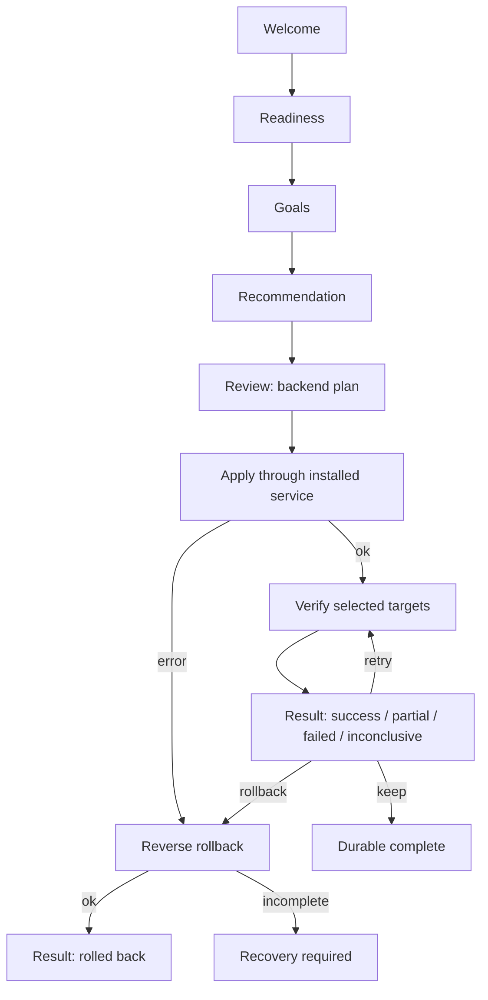

# Obsession — Installer + Onboarding V2

Статус: implemented specification
Версия flow: `2`
Актуальный baseline: 15 августа 2026

## 1. Решение

Setup и первый запуск образуют один непрерывный путь:

1. Setup устанавливает приложение и защищённую службу в `C:\Program Files\Obsession`.
2. Setup проверяет результат, сохраняет rollback/recovery journal и запускает обычный medium-integrity UI.
3. Onboarding выбирает пользовательские цели, строит план на Rust backend и выполняет его через уже установленную службу.
4. Onboarding не повышает права UI, не делает UAC handoff и не запускает произвольный helper.
5. Результат подтверждается только адресными проверками выбранных целей.

Legacy остаётся рекомендованным DPI-движком. Zapret2 доступен как `Advanced / Beta`. Для нового DPI-профиля Legacy Reliability включается только в `observe_only`.

## 2. Инварианты безопасности

- Frontend передаёт только bounded intent: draft, `planId`, `transactionId`, expected revision и destination.
- Канонические actions, пути, snapshots, fingerprints и rollback строит Rust backend.
- До Review разрешены только чтение, readiness probes и атомарная запись draft/checkpoint.
- `planId` детерминирован и идемпотентен. Повторный apply не повторяет side effects.
- Перед первой mutation backend повторно проверяет fingerprints settings, runtime capabilities, hosts и operation state.
- Apply захватывает DPI → proxy → hosts gates. Tray, hotkey и UI-команды ждут завершения той же операции.
- До каждого action записывается durable checkpoint. Crash во время apply/rollback переводит flow в `recovery_required`.
- Rollback идёт в обратном порядке и изменяет только то, что создал текущий transaction.
- Raw Rust/Windows errors записываются только в локальный `onboarding.log`; UI получает typed code.
- Никакой удалённой телеметрии нет.

## 3. Persistence

Авторитетный файл:

```text
%APPDATA%\Obsession\onboarding.json
```

Он записывается через временный файл, `fsync` и атомарный replace. Содержит:

- `flowVersion` и монотонную `revision`;
- entry point, phase и presentation;
- draft;
- immutable plan;
- transaction checkpoint и exact before-snapshot;
- verification result;
- terminal/offer status и destination.

`settings.has_completed_onboarding` остаётся compatibility-shadow. Он не является источником истины нового flow.

## 4. State machine

```ts
type OnboardingPhase =
  | "welcome"
  | "readiness"
  | "goals"
  | "recommendation"
  | "review"
  | "applying"
  | "rolling_back"
  | "verifying"
  | "result"
  | "recovery_required";
```



Progress events могут ускорять отображение, но snapshot всегда остаётся источником истины.

## 5. Entry points

### Fresh install

Если compatibility-shadow равен `false`, мастер открывается как обязательный modal. Пользователь может явно пропустить его; это сохраняется как `skipped`, а не как ложный success.

### Existing user

Мастер не открывается принудительно. Flow version 2 один раз показывает неблокирующий offer:

- `Настроить сейчас` открывает modal;
- `Не сейчас` сохраняет `dismissed` для version 2.

### Settings rerun

Повторный запуск открывает мастер с draft, выведенным из текущей конфигурации. Никакое действующее состояние не меняется до Review и повторной проверки fingerprints.

## 6. Readiness

Backend проверяет:

- доступность и версию защищённой службы;
- DPI/hosts capabilities;
- Telegram runtime и runtime manifest;
- защищённые ресурсы и Discord configs;
- возможность атомарной записи AppData;
- незавершённый onboarding journal;
- доступность proxy-port;
- наличие фиксированного repair setup.

Если runtime отсутствует или повреждён, apply запрещён. UI предлагает `Запустить восстановление`.

## 7. Recommendation и план

- Можно выбрать любую непустую комбинацию DPI, AI и Telegram.
- Discord — первая DPI-категория.
- Legacy — основной рекомендуемый движок.
- Zapret2 показывается только как Advanced/Beta и не включает adaptive search автоматически.
- AI provider ограничен allowlist `malw | geohide`.
- Существующие активные DPI/proxy sessions не перезапускаются мастером.

Review показывает для каждого backend action:

- точное пользовательское описание;
- verification;
- rollback.

## 8. Apply и rollback

Порядок apply:

1. Сохранить точный before-snapshot.
2. Атомарно сохранить operational settings.
3. При необходимости применить service-owned hosts.
4. При необходимости запустить Telegram proxy.
5. При необходимости запустить DPI для Discord.
6. Перейти к Verify.

Порядок rollback обратный:

1. Остановить только DPI-session, созданную мастером.
2. Остановить только proxy-session, созданную мастером.
3. Вернуть прежний hosts provider или исходный hosts.
4. Вернуть точный settings snapshot.

Если rollback неполный, обычный retry запрещён до journal recovery.

## 9. Verification

Мастер проверяет только выбранные цели:

- DPI: активный protected runtime + HTTPS к Discord;
- AI: service-owned hosts status + HTTPS к выбранной AI-цели;
- Telegram: owned proxy process + локальный TCP endpoint;
- отдельный control probe отличает целевой failure от общей недоступности сети.

Итоги:

- `success` — все выбранные цели подтверждены;
- `partial` — подтверждена часть целей;
- `failed` — сеть доступна, но ни одна цель не подтверждена;
- `inconclusive` — контрольная сеть не позволяет вынести честный итог.

При non-success пользователь явно выбирает retry, keep или rollback.

## 10. Backend commands

```ts
onboardingStart(entryPoint)
onboardingGetSnapshot()
onboardingCheckReadiness()
onboardingSaveDraft(draft, expectedRevision)
onboardingBuildPlan(draft, expectedRevision)
onboardingApply(planId)
onboardingGetTransaction(transactionId)
onboardingVerify(transactionId)
onboardingAcceptVerification(transactionId)
onboardingRollback(transactionId)
onboardingComplete(transactionId, destination)
onboardingSkip(expectedRevision)
onboardingCancel(expectedRevision)
launchRepairSetup()
```

Rust/Tauri wire names используют `snake_case`; TypeScript API публикует camelCase wrapper.

## 11. Repair contract

Frontend не передаёт путь. Backend принимает только фиксированный:

```text
C:\Program Files\Obsession\uninstall.exe
```

Backend canonicalizes путь, проверяет exact product directory, запускает setup без `--uninstall` и завершает приложение. Окно repair остаётся видимым пользователю.

## 12. Accessibility и layout

- modal имеет `role="dialog"`, `aria-modal`, accessible name/description и focus trap;
- app shell получает `inert` и `aria-hidden` только на время modal;
- offer остаётся неблокирующим;
- нет вложенных interactive elements;
- layout рассчитан на `800×600`, zoom 100–200% и внутренний scroll;
- reduced motion не убирает информацию или progress state;
- состояние различается текстом, формой и цветом.

## 13. Installer boundary

Installer остаётся `720×500` и сохраняет transactional engine, recovery, repair и WebView2 fallback. UI сразу показывает `bootstrapping`, использует typed failures и игнорирует stale progress по `sequence`.

Setup создаёт рядом с EXE обычный SHA-256-файл. Это checksum целостности, а не Authenticode-подпись. Документация и UI не заявляют, что setup подписан; SmartScreen может показывать предупреждение неизвестного издателя.

## 14. Test matrix

- Installer UI reducer: bootstrapping, все error codes, retry policy, event sequence, injection-safe dynamic text.
- Installer Rust: install/update/repair, downgrade, UAC decline, worker timeout, rollback и recovery.
- Onboarding backend: deterministic plan, stale revision/plan, double apply, operation gates, reverse rollback, crash recovery.
- Frontend: все phases, multi-goal, soft offer, skip/cancel, non-success choices, focus trap, no nested controls.
- E2E: fresh install, existing user offer, runtime repair, Telegram-only без UAC, retry/keep/rollback, Settings rerun.
- Visual: `800×600`, zoom 100–200%, все public themes, reduced motion, keyboard-only и forced colors.

## 15. Удалённый контракт

В Onboarding V2 отсутствуют и не должны возвращаться:

- `awaiting_elevation`;
- startup-UAC;
- `onboardingRequestElevation`;
- elevated relaunch/resume intent;
- PowerShell/ShellExecute handoff из приложения;
- frontend-provided setup/helper path.

Привилегированная работа принадлежит установленной службе и setup repair boundary.
