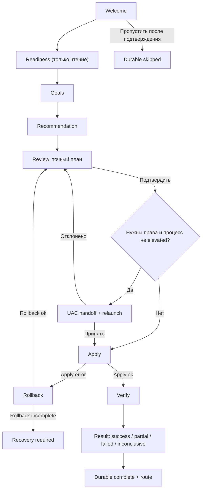

# Obsession — onboarding overhaul

Статус: implementation-ready specification
Версия документа: 1.0
Актуальный baseline: 26 июля 2026
Целевая версия flow: `2`

## 1. Решение

Нынешний частичный overhaul сохраняется как визуальная и текстовая база, но продуктовый сценарий меняется: onboarding должен не только рассказывать о функциях, а безопасно доводить выбранные функции до проверяемого рабочего состояния.

Целевой путь:

1. Объяснить, что произойдёт и чего приложение не сделает без согласия.
2. Проверить локальную готовность системы без изменений конфигурации.
3. Узнать цели пользователя: DPI, сервисы ИИ, Telegram — можно выбрать несколько.
4. Собрать понятную рекомендуемую конфигурацию. Термины Legacy и Zapret2 не нужны для обычного пути.
5. Показать точный план и получить явное подтверждение.
6. При необходимости запросить UAC и возобновить тот же план после relaunch.
7. Применить план транзакционно, с прогрессом и rollback.
8. Проверить доступ именно к выбранным целям.
9. Честно показать результат и открыть подходящий раздел приложения.

Тема и автозапуск остаются необязательной персонализацией на финальном экране. Они не должны заслонять основную задачу.

## 2. Текущий baseline и судьба уже сделанного

### Оставить

- Компактную панель, верхний счётчик и сегментированный прогресс из `src/design/components/Onboarding.tsx`.
- Ограничение высоты и внутренний scroll вместо обрезания контента на окне `800×600`.
- Карточки `InfoCard`/`NumberedRow` как визуальные примитивы.
- Спокойную анимацию смены шагов и поддержку `MotionConfig`.
- Честные объяснения WinDivert, системного `hosts` и режима надёжности «Наблюдение».
- Возможность снова открыть onboarding из Настроек.
- Идею компактного выбора темы, но не текущую реализацию интерактивных preview.

### Переделать

| Сейчас | Целевое состояние |
|---|---|
| Пять информационных шагов `intro → access → start → reliability → theme` | Машина состояний `welcome → readiness → goals → recommendation → review → apply → verify → result` |
| `has_completed_onboarding: boolean` | Версия flow, статус, checkpoint, draft и pending transaction |
| `finish()` сразу закрывает слой и запускает `patch()` без ожидания | Слой закрывается только после успешного durable persistence |
| `Enter`, стрелки и `Escape` обрабатываются глобально | Стандартная клавиатурная семантика; Escape открывает подтверждение пропуска и никогда молча не завершает flow |
| Theme core — вложенная кнопка внутри внешней кнопки | Неинтерактивный `ThemePreview` внутри единственной tile-button |
| `role="dialog"` без управления фокусом | Полный modal contract: focus trap, inert underlay, restore focus, announcements |
| Release запрашивает UAC до создания интерфейса | UAC только после подтверждённого плана, с безопасным handoff и resume |
| Под overlay продолжает работать shell и фоновые preview | Shell inert, скрыт от accessibility tree, тяжёлые сцены и preview приостановлены |

### Удалить из обязательного пути

- Обучающий шаг «Как включить обход». После функциональной настройки такой туториал не нужен; короткая подсказка остаётся на экране результата или в DPI-разделе.
- Отдельный шаг про внутреннюю архитектуру «Глаза / Память сети / Мозг». Это полезный contextual help в разделе надёжности, но не обязательное знание первого запуска.
- Обязательный выбор темы.

## 3. Цели и non-goals

### Цели

- Пользователь заранее понимает каждое системное изменение.
- До явного подтверждения не запускаются DPI/proxy, не меняется `hosts`, не включается автозапуск и не меняются operational settings.
- Рекомендуемый путь не требует знания движков и конфигов.
- Любая применяющая операция либо завершается полностью, либо возвращает предыдущее состояние.
- После crash/relaunch мастер знает, где остановился, и не повторяет side effect вслепую.
- Результат различает «работает», «не удалось проверить» и «не работает».
- Весь flow проходим с клавиатуры, на `800×600`, при zoom до 200% и с reduced motion.

### Non-goals

- Полный редактор Legacy/Zapret2-стратегий внутри onboarding.
- Автоматический режим Legacy Reliability по умолчанию. Default остаётся `observe_only`; Automatic — отдельный opt-in после onboarding.
- Настройка пользовательских списков, профилей и advanced Zapret2 DSL.
- Облачная синхронизация или удалённая аналитика. Все checkpoints и логи локальные.
- Гарантия доступности стороннего сервиса: мастер подтверждает только результат выполненных probes.

## 4. Неподвижные продуктовые инварианты

1. До `CONFIRM_PLAN` допустимы только чтение, сетевые probes с явным описанием, запись draft/checkpoint в каталог Obsession и обслуживание процессов, которые приложение доказуемо считает своими.
2. Frontend передаёт intent, но не список системных команд. Канонический plan строит и валидирует Rust backend.
3. Один `planId` применяется не более одного раза. Повторный вызов возвращает текущую транзакцию.
4. Apply и rollback сериализованы единым operation gate. DPI-кнопки, tray toggle, hotkey и другие конфликтующие команды в это время возвращают `ONBOARDING_BUSY`.
5. Ошибка apply запускает автоматический rollback. Ошибка verify не запускает rollback без решения пользователя.
6. `completed` означает durable save. `skipped` — отдельный честный статус, а не ложное «пройден».
7. UI не сообщает «готово» или «работает», пока backend не вернул соответствующий факт.
8. Zapret2 помечен `Beta` и появляется только в advanced-настройке. Рекомендованный DPI default — `legacy`.

## 5. Пользовательский flow



Branching rules:

- Можно выбрать любую непустую комбинацию `dpi`, `ai`, `telegram`.
- DPI и AI требуют elevation. Telegram-only не вызывает UAC.
- Если процесс уже elevated, экран UAC пропускается.
- Если UAC отклонён, ничего не применяется; пользователь остаётся на Review.
- Если readiness содержит blocking issue, переход к Review заблокирован. Warning не блокирует.
- Если plan устарел из-за изменения runtime/settings, apply возвращает `STALE_PLAN`; UI перестраивает plan и снова показывает Review.
- При verify failure пользователь выбирает: повторить проверку, открыть диагностику, оставить конфигурацию или откатить её.

## 6. Экраны и точный русский copy

### 6.1 Welcome — `welcome`

Kicker: `Первый запуск`
Title: `Настроим Obsession под тебя`
Description: `Сначала выберем, что должно заработать. До экрана подтверждения Obsession не запустит обход, не изменит hosts и не включит автозапуск.`

Trust block:

- `Все настройки и результаты проверок остаются на этом компьютере.`
- `Права администратора будут запрошены только после того, как ты увидишь точный план изменений.`

Controls:

- Primary: `Начать настройку`
- Ghost: `Пока пропустить`
- Footer: `Локальная настройка · без отправки данных`

Пропуск открывает отдельное подтверждение:

- Title: `Пропустить настройку?`
- Body: `Obsession ничего не изменит. Настройку можно в любой момент запустить снова из раздела «Настройки».`
- Destructive/secondary action: `Пропустить`
- Primary: `Вернуться к настройке`

После успешного `onboarding_skip` сохраняется статус `skipped`; только затем modal закрывается.

### 6.2 Readiness — `readiness`

Kicker: `Проверка системы`
Title: `Смотрим, готова ли система`
Description: `Сейчас Obsession проверяет только готовность. Настройки Windows и сетевые режимы не меняются.`

Проверка writable AppData может создать и сразу удалить служебный файл только внутри каталога Obsession; это относится к заранее разрешённым app-owned данным, а не к системной конфигурации.

Checks:

- `Ресурсы Obsession` — binaries, lists, configs, manifest/signature.
- `Каталог данных` — доступен для durable checkpoints и backup.
- `Текущий запуск` — `Права пока не запрошены`, `Права уже есть` либо реальная ошибка определения.
- `Конфликты` — порт Telegram, доказуемо собственные незавершённые runtime и pending recovery.

Статусы: `Проверяем…`, `Готово`, `Нужно внимание`, `Не готово`. У каждой warning/error есть раскрываемое объяснение и remediation.

Controls:

- Primary: `Продолжить`
- Ghost: `Проверить ещё раз`
- Back: `Назад`

Loading не блокирует закрытие окна. `Продолжить` доступна после завершения обязательных локальных checks и отсутствия blocking errors.

### 6.3 Goals — `goals`

Kicker: `Твои задачи`
Title: `Что должно заработать?`
Description: `Можно выбрать несколько вариантов. На следующем шаге Obsession предложит безопасную конфигурацию.`

Multi-select cards:

1. `Сайты и приложения`
   `DPI-обход для Discord, YouTube и Twitch, игр или универсального набора.`
2. `Сервисы ИИ`
   `Доступ к ChatGPT, Claude, Gemini и другим поддерживаемым сервисам через управляемый hosts-профиль.`
3. `Telegram`
   `Локальный MTProto-прокси и ссылка или QR-код для подключения.`

Если выбран DPI, внутри карточки раскрывается обязательный выбор минимум одной категории:

- `Discord` — selected by default;
- `YouTube / Twitch`;
- `Игры`;
- `Универсальный набор`;
- `Под угрозой`.

Controls: `Назад`, `Продолжить`. Primary disabled, пока не выбрана хотя бы одна цель и, для DPI, хотя бы одна категория. Причина disabled доступна через текст рядом, а не только цветом.

### 6.4 Recommendation — `recommendation`

Kicker: `Рекомендация`
Title: `Вот настройка для твоих задач`
Description: `Мы выбрали стабильные значения. Их можно изменить сейчас или позже в соответствующем разделе.`

Показываются только выбранные цели:

- DPI: `Стабильный движок` / `Legacy` мелким техническим label; выбранные категории; режим надёжности `Наблюдение`.
- AI: точное имя выбранного встроенного hosts-профиля и фраза `Перед изменением будет создан backup`.
- Telegram: точный bind/port, по умолчанию `1443`; если он занят, backend предлагает первый свободный из `1443…1453` и показывает замену.

Advanced disclosure: `Изменить вручную`. Внутри можно выбрать Zapret2 только как `Zapret2 · Beta` с коротким предупреждением. Automatic Reliability здесь не предлагается.

Для нового профиля Legacy Reliability изначально disabled. Он включается в `observe_only` только если подтверждён и успешно применён DPI-goal; для AI/Telegram-only и Skip остаётся disabled. Manual onboarding существующего профиля сохраняет его прежнее значение, если plan явно не содержит изменение.

Controls: `Назад`, `Использовать эту настройку`.

### 6.5 Review — `review`

Kicker: `Подтверждение`
Title: `Проверь план изменений`
Description: `До нажатия кнопки ниже ничего из этого списка не будет применено.`

Backend возвращает и UI дословно визуализирует structured actions, не произвольную заранее написанную сводку. Примеры строк:

- `Выбрать стабильный DPI-движок и категории: Discord, YouTube / Twitch.`
- `Проверить до N встроенных DPI-конфигов для выбранных категорий и запустить первый подтверждённый вариант.`
- `Загрузить выбранный hosts-профиль из указанного в приложении источника, проверить его и создать backup системного hosts перед установкой.`
- `Запустить локальный Telegram-прокси на порту 1443.`
- `Оставить надёжность в режиме «Наблюдение».`
- `Автозапуск не изменится.`

Network disclosure: `Во время применения и проверки Obsession обратится только к источнику выбранного hosts-профиля и к сервисам, которые ты выбрал. Настройки и результаты останутся на этом компьютере.` Ссылка на список конкретных hostnames доступна через `Что будет проверено?` до Confirm.

Privilege block, если нужен:

`Для DPI и изменения hosts понадобятся права администратора. После подтверждения Windows покажет стандартный запрос UAC, а Obsession вернётся к этому плану автоматически.`

Controls:

- Back: `Изменить выбор`
- Primary без UAC: `Применить настройку`
- Primary с UAC: `Продолжить и запросить права`

Клик — единственная точка согласия на системные изменения. Plan должен быть уже durable и иметь неизменяемый `planId`.

### 6.6 Awaiting elevation — `awaiting_elevation`

Перед системным prompt UI показывает:

- Title: `Подтверди запрос Windows`
- Body: `Windows откроет стандартное окно контроля учётных записей. Проверь имя приложения Obsession и выбери «Да».`

Если пользователь отказал или spawn не удался:

- Inline error: `Права не получены. Ничего не изменено.`
- Actions: `Попробовать ещё раз`, `Вернуться к плану`.

Нельзя помечать отказ как apply error: транзакция ещё не началась.

### 6.7 Apply — `applying`

Kicker: `Настройка`
Title: `Применяем выбранный план`
Description: `Obsession выполняет только подтверждённые действия. Если один шаг не удастся, предыдущие изменения будут отменены.`

Для каждого action показываются состояния `Ожидает`, `Выполняется`, `Готово`, `Отменено`, `Ошибка`. Общий progress берётся из backend events, а не вычисляется frontend-таймерами.

До первой mutation доступно `Отменить`. После неё действие называется `Прервать и откатить` и запускает cooperative cancellation. Закрытие приложения во время apply оставляет durable recovery checkpoint.

### 6.8 Verify — `verifying`

Kicker: `Проверка доступа`
Title: `Проверяем выбранные сервисы`
Description: `Проверяем только те цели, которые ты выбрал. Временный сбой сервиса будет отмечен отдельно от ошибки настройки.`

Result states на target:

- `Доступ подтверждён` — probe success по определённому критерию.
- `Доступ не подтвердился` — reproducible failed criterion.
- `Не удалось проверить` — timeout, DNS ambiguity, endpoint unavailable или cancelled.

Controls зависят от результата: `Проверить ещё раз`, `Открыть диагностику`, `Оставить настройку`, `Откатить изменения`.

При полном success переход к Result автоматический. При `partial/failed/inconclusive` кнопка `Оставить настройку` вызывает durable `onboardingAcceptVerification`; только после его успеха открывается Result. `Откатить изменения` запускает rollback и возвращает к Review после восстановления исходного состояния.

### 6.9 Result — `result`

Заголовки строго зависят от результата:

- All verified: `Готово — выбранные функции работают`
- Mixed: `Настройка применена, но не всё удалось проверить`
- All inconclusive: `Настройка применена — проверку стоит повторить`
- Verified failure kept by user: `Настройка сохранена, но доступ пока не подтвердился`

Каждая goal-card содержит итог и contextual route: `Открыть DPI`, `Открыть ИИ`, `Открыть Telegram`.

Collapsed optional block `Персонализация`:

- статические theme previews без вложенных controls;
- checkbox `Запускать Obsession вместе с Windows`, отражает текущее значение (на fresh profile выключен) и применяется только по отдельному клику/изменению;
- подпись `Это можно изменить позже в Настройках`.

Primary:

- одна цель — `Открыть <раздел>`;
- несколько целей — `Открыть Обзор`.

Сначала вызывается `onboarding_complete`; только после успешного ответа выполняются routing и unmount. При ошибке modal остаётся открыт: `Не удалось сохранить завершение. Повтори попытку.`

## 7. State machine и persistence

### 7.1 Persisted model

Не использовать один boolean как источник истины. Добавить отдельный durable файл `%APPDATA%\Obsession\onboarding.json`; operational settings остаются в `settings.json`.

```ts
type OnboardingPhase =
  | "welcome"
  | "readiness"
  | "goals"
  | "recommendation"
  | "review"
  | "awaiting_elevation"
  | "applying"
  | "rolling_back"
  | "verifying"
  | "result"
  | "recovery_required";

type OnboardingStatus =
  | "not_started"
  | "in_progress"
  | "completed"
  | "skipped"
  | "recovery_required";

interface PersistedOnboardingState {
  schemaVersion: 1;
  flowVersion: 2;
  revision: number;
  status: OnboardingStatus;
  phase: OnboardingPhase;
  entryPoint: "first_run" | "settings";
  previousTerminalStatus: "completed" | "skipped" | null;
  draft: OnboardingDraft | null;
  pendingPlan: PersistedPlan | null;
  transaction: TransactionCheckpoint | null;
  lastResult: VerificationSummary | null;
  completedAtMs: number | null;
  skippedAtMs: number | null;
}
```

Файл сохраняется durable temp write + atomic replace по тому же принципу, что `Settings::save`. Запись выполняется backend-ом под отдельным mutex. Frontend не пишет JSON напрямую.

`has_completed_onboarding` временно остаётся compatibility shadow:

- `completed` и `skipped` обновляют его в `true` best-effort после записи authoritative terminal state; ошибка shadow-write логируется, но не отменяет уже durable terminal state;
- новый UI принимает решение по `onboarding.json` и `flowVersion`, не по boolean;
- после двух совместимых релизов boolean можно удалить отдельной миграцией.

### 7.2 Transition table

| From | Event | To | Durable before UI transition |
|---|---|---|---|
| `not_started/welcome` | `START` | `readiness` | yes |
| `readiness` | `READINESS_OK` | `goals` | yes |
| `goals` | `SAVE_GOALS` | `recommendation` | yes |
| `recommendation` | `BUILD_PLAN` | `review` | plan + preconditions |
| `review` | `CONFIRM`, no elevation | `applying` | transaction snapshot |
| `review` | `CONFIRM`, elevation needed | `awaiting_elevation` | plan + parent handoff state |
| `awaiting_elevation` | `ELEVATED_RESUME` | `applying` | transaction snapshot |
| `awaiting_elevation` | `DECLINED` | `review` | error code only |
| `applying` | `APPLY_OK` | `verifying` | applied checkpoint |
| `applying` | `APPLY_ERROR` | `rolling_back` | failure + rollback cursor |
| `rolling_back` | `ROLLBACK_OK` | `review` | cleared transaction |
| `rolling_back` | `ROLLBACK_INCOMPLETE` | `recovery_required` | remaining recovery actions |
| `verifying` | `VERIFY_SUCCESS` | `result` | successful result |
| `verifying` | `VERIFY_NON_SUCCESS` | `verifying` | partial/failed/inconclusive result |
| `verifying` | `ACCEPT_VERIFICATION` | `result` | explicit keep decision |
| `verifying` | `ROLLBACK` | `rolling_back` | rollback cursor |
| `result` | `COMPLETE` | `completed` | completed version/time |
| `welcome` | `SKIP_CONFIRMED` | `skipped` | skipped version/time |

Back-navigation до Review обновляет только draft и инвалидирует старый plan. Back-navigation после начала apply запрещена.

Повторный запуск из Settings использует `entryPoint="settings"` и запоминает `previousTerminalStatus`. `Cancel` до Confirm возвращает прежний terminal status; незавершённая manual session после crash не форсирует modal на следующем старте, но Settings предлагает `Продолжить настройку`.

### 7.3 Resume rules

- Non-mutating phases возобновляются с последнего durable phase и сохранённым draft.
- `awaiting_elevation` без elevated process возвращается на Review с сообщением `Повышение прав не завершено`.
- `applying`/`rolling_back` после crash не продолжают слепо apply. Backend сверяет journal и идемпотентно завершает rollback, затем отдаёт `review` либо `recovery_required`.
- `verifying` после crash можно безопасно запустить заново.
- `completed/skipped` текущей flowVersion не показываются автоматически; Settings показывает соответствующий статус и кнопку повторного запуска.

## 8. Backend contracts

Все новые wire-типы получают `#[serde(rename_all = "camelCase")]`; enum values — `snake_case`. В каждом response есть `schemaVersion` и `revision` либо transaction `sequence`.

### 8.1 Intent, readiness и plan

```ts
type OnboardingGoal = "dpi" | "ai" | "telegram";
type DpiCategory = "discord" | "youtube_twitch" | "gaming" | "universal" | "atrisk";

interface OnboardingDraft {
  goals: OnboardingGoal[];
  dpi: null | {
    categories: DpiCategory[];
    choice: "recommended" | "advanced";
    advancedEngine: "legacy" | "zapret2" | null;
  };
  ai: null | { provider: string };
  telegram: null | { requestedPort: number };
}

type ReadinessCode =
  | "resources"
  | "app_data"
  | "elevation"
  | "pending_recovery"
  | "telegram_port"
  | "owned_runtime";

interface ReadinessCheck {
  code: ReadinessCode;
  state: "passed" | "warning" | "blocking";
  detailCode: string | null;
  facts: Record<string, string | number | boolean>;
}

interface OnboardingSnapshot {
  schemaVersion: 1;
  flowVersion: 2;
  revision: number;
  state: PersistedOnboardingState;
  elevated: boolean;
  readiness: ReadinessCheck[];
  capabilities: {
    canRequestElevation: boolean;
    availableDpiEngines: Array<"legacy" | "zapret2">;
    availableAiProviders: string[];
  };
}

type PlanActionKind =
  | "select_dpi_configuration"
  | "probe_dpi_candidates"
  | "start_dpi"
  | "download_hosts_profile"
  | "backup_hosts"
  | "install_hosts_profile"
  | "start_telegram_proxy"
  | "persist_operational_settings";

interface OnboardingPlanAction {
  actionId: string;
  kind: PlanActionKind;
  requiresElevation: boolean;
  summaryCode: string;
  facts: Record<string, string | number | string[]>;
  rollbackCode: string;
}

interface OnboardingPlan {
  schemaVersion: 1;
  planId: string;
  planRevision: number;
  intentHash: string;
  preconditions: {
    sourceInstanceId: string;
    onboardingRevision: number;
    settingsRevision: number;
    dpiRevision: number;
    proxyRevision: number;
    hostsRevision: number;
    settingsFingerprint: string;
    dpiFingerprint: string;
    proxyFingerprint: string;
    hostsFingerprint: string;
  };
  requiresElevation: boolean;
  actions: OnboardingPlanAction[];
  verificationTargets: VerificationTarget[];
  warnings: Array<{ code: string; facts: Record<string, string | number> }>;
}

type PersistedPlan = OnboardingPlan;

interface TransactionCheckpoint {
  transactionId: string;
  planId: string;
  state:
    | "prepared"
    | "applying"
    | "applied"
    | "rolling_back"
    | "rolled_back"
    | "recovery_required";
  nextApplyIndex: number;
  nextRollbackIndex: number | null;
  appliedActionIds: string[];
  startedAtMs: number;
}

interface TransactionSnapshot extends TransactionCheckpoint {
  actions: Array<{
    actionId: string;
    state: "pending" | "running" | "succeeded" | "failed" | "rolled_back";
    errorCode: string | null;
  }>;
}

type AppTab = "overview" | "dpi" | "ai" | "telegram" | "lists" | "profiles" | "settings";

type ElevationHandoffResult =
  | { state: "started"; childPid: number }
  | { state: "cancelled" }
  | { state: "failed"; errorCode: string };
```

`facts` содержит только backend-validated значения. UI мапит `summaryCode/detailCode` на локализованный copy; backend message не вставляется как HTML.

Runtime `RevisionClock` в текущем backend process-local и после relaunch начинается заново. Поэтому numeric revisions — только быстрый guard в пределах `sourceInstanceId`. Для UAC/resume и обычного cold restart authoritative precondition — стабильный SHA-256 fingerprint нормализованного relevant state. Fingerprint не включает timestamps, PID нового процесса и прочие нестабильные поля; алгоритм и canonical serialization покрываются fixtures.

### 8.2 Commands

```ts
onboardingStart(entryPoint: "first_run" | "settings"): Promise<OnboardingSnapshot>
onboardingGetSnapshot(): Promise<OnboardingSnapshot>
onboardingCheckReadiness(): Promise<OnboardingSnapshot>
onboardingSaveDraft(draft: OnboardingDraft, expectedRevision: number): Promise<OnboardingSnapshot>
onboardingBuildPlan(draft: OnboardingDraft, expectedRevision: number): Promise<OnboardingPlan>
onboardingRequestElevation(planId: string): Promise<ElevationHandoffResult>
onboardingApply(planId: string): Promise<TransactionSnapshot>
onboardingCancelAndRollback(transactionId: string): Promise<TransactionSnapshot>
onboardingVerify(transactionId: string): Promise<VerificationSummary>
onboardingAcceptVerification(transactionId: string): Promise<OnboardingSnapshot>
onboardingRollback(transactionId: string): Promise<TransactionSnapshot>
onboardingComplete(
  transactionId: string,
  destination: AppTab,
  acceptUnverified: boolean,
): Promise<OnboardingSnapshot>
onboardingSkip(expectedRevision: number): Promise<OnboardingSnapshot>
onboardingCancel(expectedRevision: number): Promise<OnboardingSnapshot>
```

Semantics:

- `saveDraft` использует optimistic concurrency. `REVISION_CONFLICT` заставляет frontend получить snapshot и повторно показать актуальные данные.
- `start("settings")` не сбрасывает прежний terminal status; он создаёт manual session. `cancel` допустим только до Confirm и восстанавливает этот status.
- `buildPlan` — pure относительно operational state, кроме durable сохранения самого pending plan. Он не запускает executables и не меняет settings/hosts/registry.
- `apply` повторно валидирует preconditions, elevation и ресурсы. В исходном процессе используются revisions + fingerprints; после relaunch — fingerprints и prepared journal. При несовпадении возвращается typed `STALE_PLAN`, не частичный side effect.
- `apply` с уже применяющимся `planId` возвращает текущую транзакцию; с другим planId во время operation — `ONBOARDING_BUSY`.
- `apply` после валидации запускает coordinator task и быстро возвращает snapshot `applying`; долгую работу и progress нельзя держать внутри frontend-цепочки IPC-вызовов.
- `acceptVerification` нужен только для `partial/failed/inconclusive` и durable фиксирует решение оставить applied configuration. Для success переход в Result автоматический.
- `complete` допустим только после apply и verification. При неуспешной проверке backend дополнительно требует ранее вызванный `acceptVerification` и `acceptUnverified=true`; случайный финальный click не может молча принять failed result. Destination валидируется enum-ом backend-а, но routing выполняет frontend.

Typed command errors сериализуются структурой, а не строкой:

```ts
interface OnboardingCommandError {
  schemaVersion: 1;
  code:
    | "REVISION_CONFLICT"
    | "INVALID_TRANSITION"
    | "INVALID_INTENT"
    | "STALE_PLAN"
    | "ELEVATION_REQUIRED"
    | "UAC_CANCELLED"
    | "ONBOARDING_REQUIRED"
    | "ONBOARDING_BUSY"
    | "RESOURCE_MISSING"
    | "APPLY_FAILED"
    | "ROLLBACK_INCOMPLETE"
    | "PERSISTENCE_FAILED";
  retryable: boolean;
  detailCode: string | null;
  facts: Record<string, string | number | boolean>;
}
```

Rust commands возвращают `Result<T, OnboardingCommandError>`. Raw OS error остаётся только в локальном журнале.

### 8.3 Progress events

Event: `onboarding://transaction-progress`

```ts
interface OnboardingProgressEvent {
  schemaVersion: 1;
  transactionId: string;
  sequence: number;
  phase: "applying" | "rolling_back" | "verifying";
  actionId: string | null;
  actionState: "pending" | "running" | "succeeded" | "failed" | "rolled_back";
  completedUnits: number;
  totalUnits: number;
  messageCode: string;
  facts: Record<string, string | number>;
}
```

Events — ускоритель UI, не источник истины. После mount/resume и при gap в `sequence` frontend получает `onboardingGetSnapshot()`.

### 8.4 Rust ownership

Рекомендуемая структура:

```text
src-tauri/src/onboarding/
  mod.rs            # commands facade and AppState integration
  model.rs          # serde contracts and state transitions
  persistence.rs    # durable onboarding.json + journal
  plan.rs           # intent validation and canonical plan builder
  transaction.rs    # apply, operation gate, rollback
  verify.rs          # goal-specific verification
  elevation.rs       # ShellExecuteExW handoff/resume
```

Frontend:

```text
src/design/components/onboarding/
  Onboarding.tsx          # modal shell only
  OnboardingController.tsx
  OnboardingProgress.tsx
  ThemePreview.tsx
  steps/*.tsx
src/store/onboardingStore.ts
src/lib/onboardingContract.ts
```

Inline `steps` и side effects не должны оставаться в одном 450+ line component.

## 9. UAC, process handoff и single-instance

### 9.1 Обязательное изменение startup

Удалить blanket relaunch из `src-tauri/src/lib.rs`, который сейчас выполняется до `tauri::Builder`. Release должен уметь открыть trust screen без elevation. Привилегированные команды вне onboarding тоже обязаны делать capability check и возвращать typed `ELEVATION_REQUIRED`, а не надеяться на startup-UAC.

### 9.2 Handoff protocol

1. Review вызывает `onboardingRequestElevation(planId)`.
2. Backend под mutex проверяет plan, снимает полный before-snapshot и durable создаёт transaction в состоянии `prepared`; затем сохраняет phase `awaiting_elevation`. Никаких runtime mutations на этом шаге нет.
3. Windows-реализация использует `ShellExecuteExW` с verb `runas`, текущим exe и аргументами:
   `--wait-for-pid <oldPid> --resume-onboarding <planId>`.
4. Нужен `SEE_MASK_NOCLOSEPROCESS`, чтобы отличить успешный spawn от `ERROR_CANCELLED`. PowerShell `Start-Process` больше не является handoff-контрактом.
5. Elevated child до создания `tauri::Builder` ждёт завершения `oldPid` с bounded timeout. Это происходит до инициализации `tauri-plugin-single-instance`, иначе child будет отвергнут старым instance-lock.
6. После успешного spawn старый процесс планово завершает UI/runtime. Если штатный teardown останавливает owned DPI/proxy, это journaled handoff-action: их исходные descriptors уже находятся в prepared snapshot. Pending plan и transaction не удаляются.
7. Child получает single-instance lock, проверяет elevation, `planId`, prepared checkpoint и stable fingerprints с учётом ожидаемого handoff teardown, затем показывает wizard на `applying`. Process-local revision numbers после relaunch не сравниваются как authoritative.
8. Если UAC отменён, старый процесс остаётся жив и возвращает typed `UAC_CANCELLED`; phase возвращается на `review`.

Safety details:

- `planId` не секрет, но child принимает его только при совпадении с durable pending plan.
- Timeout ожидания parent не должен вести к двум активным runtime: child повторно проверяет ownership/single-instance.
- Если child не дошёл до apply, следующий запуск видит `prepared` transaction и либо восстанавливает остановленные handoff-ом runtime, либо безопасно продолжает после нового подтверждения; он не выдаёт чистый Review поверх изменившегося runtime.
- Никакого автоматического повторного UAC-loop.
- Аргументы relaunch сохраняют intent `start_minimized` только если onboarding не активен; resume onboarding всегда показывает окно.
- Debug `tauri dev` не relaunch-ится автоматически. Контракт тестируется mock-реализацией, а реальный UAC — signed release matrix.

### 9.3 Elevation вне onboarding

Удаление blanket startup-UAC не должно ломать существующих completed-пользователей. Handoff реализуется общим `ElevationCoordinator` с двумя строго типизированными resume intents:

```ts
type ElevationResumeIntent =
  | { kind: "onboarding"; planId: string }
  | { kind: "app"; destination: "dpi" | "ai" | "settings" };
```

- Onboarding intent после relaunch может продолжить apply, потому что пользователь подтвердил immutable plan.
- App intent только открывает нужный раздел и объясняет, что права получены; он не повторяет прежнюю privileged-команду автоматически.
- Клик по DPI/hosts action при отсутствии прав получает `ELEVATION_REQUIRED` и показывает локальное подтверждение relaunch.
- Tray/hotkey при отсутствии прав не вызывает внезапный UAC поверх другого приложения: он показывает окно Obsession на нужном разделе с запросом пользователя.
- Autostart запускает приложение без UAC; elevation остаётся on-demand.

Этот compatibility path входит в тот же single-instance/UAC test matrix.

## 10. Apply, rollback и crash recovery

### 10.1 Apply order

Перед первой mutation backend сохраняет transaction journal и snapshot:

- полный relevant `Settings`;
- текущий DPI engine/categories/configs и owned process descriptors;
- proxy state/port;
- `hosts` provider/status и byte-exact recovery reference;
- revisions всех preconditions.

Для пути с UAC этот `prepared` snapshot создаётся до spawn elevated child. Для пути без UAC — непосредственно в `CONFIRM`. Apply не снимает новый «before» поверх уже выполненного process handoff.

Порядок:

1. Повторный preflight и canonical resolution конфигов/порта.
2. Создание recovery artifacts и fsync journal.
3. Остановка только конфликтующих Obsession-owned runtime, если это требуется.
4. Bounded-проверка кандидатов и запуск Legacy DPI для выбранных категорий.
5. Загрузка hosts-профиля во временный app-owned файл, проверка формата/hash/source policy.
6. Создание byte-exact hosts backup и атомарная установка проверенного профиля.
7. Запуск Telegram proxy и readiness check локального listener.
8. Atomic persistence operational settings: для fresh DPI-goal Reliability включается только в `observe_only`, Automatic paused; без DPI остаётся disabled, а manual flow сохраняет прежнее значение, если его изменение не было в plan.
9. Journal state `applied`, затем переход к verify.

Не выбранная цель не трогается. Если proxy/DPI уже работали до onboarding, plan обязан явно показать, будет ли runtime перезапущен.

### 10.2 Rollback order

Rollback идёт в обратном порядке, каждый шаг идемпотентен и journaled:

1. Восстановить settings snapshot.
2. Остановить созданный onboarding-ом proxy и восстановить прежний proxy state.
3. Восстановить byte-exact `hosts` и metadata/backup state.
4. Удалить незакоммиченные downloaded artifacts из app-owned temp/cache; уже существующий проверенный cache не удалять.
5. Остановить созданные DPI processes и, если до apply работал owned DPI runtime, восстановить его конфигурацию.
6. Очистить transaction только после подтверждения всех шагов.

Если rollback неполный, нельзя показывать Review как будто состояние чистое. Phase — `recovery_required`, с перечнем оставшихся actions, кнопками `Повторить восстановление` и `Экспортировать журнал`.

### 10.3 Verify policy

- Apply failure → автоматический rollback.
- Verify failure/inconclusive → конфигурация остаётся applied до решения пользователя.
- `Откатить изменения` после verify использует тот же transaction snapshot.
- `Оставить настройку` фиксирует решение и разрешает complete, но итоговый copy остаётся честным.

## 11. Goal-specific verification

```ts
interface VerificationTarget {
  targetId: string;
  goal: OnboardingGoal;
  labelCode: string;
  category: string | null;
  required: boolean;
}

interface VerificationResult {
  targetId: string;
  state: "success" | "failed" | "inconclusive" | "cancelled";
  reasonCode: string;
  latencyMs: number | null;
  attempts: number;
}

interface VerificationSummary {
  transactionId: string;
  state: "success" | "partial" | "failed" | "inconclusive";
  results: VerificationResult[];
  verifiedAtMs: number;
}
```

Rules:

- DPI проверяет targets выбранных категорий; fixed `diagnose()` можно переиспользовать для Discord/YouTube/Twitch/Instagram/Google, но недостающим категориям нужны явные target definitions.
- AI проверяет endpoints выбранного provider/profile после hosts install.
- Telegram сначала проверяет owned process и local listener, затем outbound handshake. Наличие установленного Telegram не требуется.
- Probes имеют общий cancel token, per-target timeout и bounded retry. Запускаются параллельно с ограничением concurrency.
- HTTP redirect/captive portal, DNS ambiguity, endpoint outage и timeout дают `inconclusive`, а не ложный failed.
- UI никогда не выводит raw URL, IP или системную ошибку как основной текст; детали доступны в diagnostics/log.

## 12. Frontend integration

`App.tsx` должен владеть routing callback:

```ts
<Onboarding
  active={showOnboarding}
  onNavigate={(tab) => selectTab(tab)}
  onFinished={() => refreshOnboardingSnapshot()}
/>
```

Показ определяется не optimistic settings patch, а authoritative onboarding status текущей flowVersion. Пока snapshot загружается на первом запуске, показывается нейтральный onboarding skeleton, а не интерактивный shell под ним.

Пока first-run flow не достиг terminal state:

- startup не запускает Legacy Eyes/Brain/automatic recovery и другие operational observers;
- tray/hotkey не могут включить DPI в обход modal: они поднимают окно onboarding либо возвращают `ONBOARDING_REQUIRED`;
- underlying navigation и controls inert;
- уже существующие runtime при manual launch только читаются до Confirm и явно отражаются в plan.

`onboardingStore`:

- хранит server snapshot, transient UI selection и current request id;
- не реализует системную orchestration через вызовы нескольких stores;
- игнорирует events другого `transactionId` и stale `sequence`;
- блокирует double-submit;
- abort-ит readiness/verify requests при unmount, но не прерывает backend apply без явного rollback action.

Theme previews получают отдельный контракт:

```ts
<ThemePreview theme={id} selected={selected} paused={motionOff || !selected} />
```

Preview root — `div` с `aria-hidden="true"`, без `button`, `tabIndex` и `onClick`. Единственный control — внешняя tile-button с `type="button"`, `aria-pressed` и доступным именем.

## 13. Accessibility contract

### Modal

- `role="dialog"`, `aria-modal="true"`, `aria-labelledby` на текущий `h2`, `aria-describedby` на description.
- При открытии и после каждой смены step focus идёт на новый `h2` с `tabIndex={-1}`; Tab/Shift+Tab замкнуты внутри.
- Underlay получает native `inert` и `aria-hidden="true"`; после закрытия прежний focus восстанавливается, особенно для `Показать снова` в Settings.
- Оригинальный custom titlebar входит в inert shell. Modal-layer содержит `ModalTitleBar` с теми же drag/minimize/close controls и является частью dialog/focus boundary; интерактивных controls вне `aria-modal` dialog нет.
- Перенос focus на `h2` служит объявлением нового step; отдельный live-message с тем же заголовком запрещён, чтобы screen reader не говорил его дважды. Apply error/recovery — `role="alert"`.
- Determinate progress имеет `role="progressbar"`, `aria-valuemin/max/now` и текстовый fallback. Для indeterminate `aria-valuenow` отсутствует. Live-region сообщает только смену action/milestone, не каждый технический event.
- Skip-confirmation возвращает focus на вызвавшую кнопку при Cancel. После финального routing focus переходит на `h1`/heading целевого раздела.

### Keyboard

- Удалить window-level `Enter` и ArrowLeft/ArrowRight. Сейчас Enter на tile/button одновременно активирует control и может перевести шаг.
- Enter/Space работают только по нативной семантике focused control.
- Escape не завершает flow. До apply он открывает подтверждение пропуска/выхода; во время apply предлагает safe rollback; во время UAC не перехватывается.
- Не назначать стрелкам изменение шагов: внутри checkbox/radio/list они должны сохранять ожидаемое поведение.
- Goals/categories оформлены как `fieldset` + checkbox; выбор движка — radiogroup; disclosure имеет `aria-expanded`/`aria-controls`; invalid group — `aria-invalid` + `aria-describedby`.
- Корневой документ/приложение имеет `lang="ru"`; англоязычные технические фрагменты при необходимости получают локальный `lang`.

### Visual and zoom

- Normal text: contrast не ниже `4.5:1`; meaningful UI boundaries, state icons и focus indicators — не ниже `3:1`. Чисто декоративные borders не являются способом передать состояние.
- `text-ink-muted` нельзя использовать для обязательного обычного текста, пока token не проходит contrast на всех темах.
- Hit target минимум `44×44 CSS px`, включая Skip/Back/icon controls.
- Focus ring виден на всех темах и не обрезается `overflow`.
- Panel: `max-height: calc(100dvh - 56px)`; header/footer фиксированы внутри layout, middle — `minmax(0, 1fr)` + scroll. Не полагаться только на `44vh`.
- Проверить `800×600` при 100%, 125%, 150%, 200%; на узкой CSS-ширине карточки становятся одной колонкой.
- Reduced motion отключает step translations, cascades и canvas motion. Информация не зависит от анимации.
- Windows `forced-colors`/High Contrast сохраняет видимые labels, selected/checked state, errors и focus indicator без зависимости от background image/box-shadow.

## 14. Performance contract

- Reference profile для release gate: Windows 10 22H2 или Windows 11 23H2+, актуальный stable WebView2, 2 физических/4 логических CPU ≥2.0 GHz, 8 GB RAM, integrated GPU. Замеры выполняются на release build: 30 cold samples для startup/readiness и не менее 100 warm samples для interaction; вместе с результатом сохраняются версии ОС/WebView2 и характеристики машины.
- При открытом onboarding underlying `HeroField` frozen; Parallax pointer updates и continuous theme loops приостановлены.
- До Result активных continuous preview RAF/WAAPI loops нет. На Result одновременно анимируется не более одного выбранного preview; предпочтительны статические thumbnails.
- Readiness и verify не создают по React render на каждый low-level probe event; progress агрегируется backend-ом и throttled до ≤10 UI events/sec.
- Step change не должен вызывать повторный startup/bootstrap или повторную распаковку ресурсов.
- Readiness local checks: целевой p95 ≤500 ms без recovery scan; network verify имеет видимый progress и bounded timeout.
- UI остаётся responsive: input-to-next-paint для Next/Back/goal toggle p95 ≤100 ms и p99 ≤200 ms на reference profile.
- Verify: per-attempt timeout 4 s, не более одного retry только для transient reason codes, concurrency ≤4, общий hard deadline 20 s. Cancel acknowledgement в UI ≤250 ms, остановка backend probes ≤1 s.
- Новые onboarding steps загружаются отдельным chunk после определения, что flow нужен; основной shell завершённых пользователей не должен тащить theme preview implementations.

Автоматизированные performance assertions проверяют event throttle, deadlines/cancel, отсутствие underlying RAF/continuous loops, readiness p95, interaction p95 и то, что completed-user cold path не запрашивает onboarding/theme-preview chunk.

## 15. Testing strategy

Standalone `localhost` без Tauri internals не считается валидным E2E окружением. Нужны оба слоя: mock invoke-harness для быстрых UI-тестов и Windows Tauri E2E для process/UAC/runtime.

### Unit — frontend

- Все допустимые и недопустимые state transitions.
- Multi-goal selection, DPI category invariant, advanced Beta opt-in.
- Stale revision/event sequence handling.
- Double-click/double-submit и unmount during async request.
- Result copy для success/partial/failed/inconclusive.
- Routing выбирается только после successful complete.
- ThemePreview не содержит вложенных interactive elements.

Добавить `@testing-library/react`, `@testing-library/user-event`, `@testing-library/jest-dom`, `jsdom` и axe-проверку. Axe gate: `0` serious/critical violations на всех стабильных phases, skip-confirmation, apply error, rollback и recovery-required.

### Unit — Rust

- Intent validation и canonical plan determinism.
- Precondition mismatch → `STALE_PLAN` до mutation.
- Apply idempotency по `planId`.
- Rollback каждого action и повтор rollback после crash checkpoint.
- Atomic onboarding persistence under concurrency/power-loss simulation.
- Migration boolean → flowVersion/status.
- Operation gate блокирует tray/hotkey/conflicting commands.
- Verification classification и timeout/cancellation.
- CLI argument parser и resume validation.
- `complete` до `ACCEPT_VERIFICATION` для non-success результата возвращает `INVALID_TRANSITION`.

### Contract/integration

- Rust JSON fixtures декодируются TypeScript contract tests.
- Event gap приводит к snapshot catch-up.
- Existing bootstrap schema 5 не ломается; если onboarding section позже войдёт в bootstrap, schema bump тестируется отдельно.
- Settings failure на complete оставляет modal открытым.
- Hosts/DPI/proxy fault injection на каждом apply step даёт ожидаемый rollback.
- Все 7 непустых комбинаций goals в режимах first-run/settings; standard/elevated; recommended/Zapret2 Beta.
- Persistence failures отдельно для skip, accept-verification и complete; corrupt migration; event gap; retry/cancel verify; manual reopen при активном runtime.

### Accessibility/manual UI matrix

| Case | Expected |
|---|---|
| Keyboard only | Полный flow, предсказуемый focus order, trap и restore |
| Screen reader | Step/title/progress/error объявляются один раз |
| Escape на каждом phase | Нет молчаливого complete или потери transaction |
| `800×600`, 100–200% | Header/footer доступны, body scroll, ничего не обрезано |
| Все темы | Contrast/focus ring проходят; copy читаем |
| Reduced motion | Нет translate/cascade/canvas loops |
| Long errors/localization | Layout не ломается, error details scrollable |
| Windows forced-colors | Labels/state/error/focus остаются различимы |

Ручная AT-матрица выполняется в реальном WebView2 отдельно с NVDA и Narrator. Для каждого сохраняется checklist, включая отсутствие двойного объявления heading/progress.

### Windows/UAC E2E matrix

- Fresh install, standard user, UAC accept.
- Fresh install, UAC decline, retry.
- Process already elevated.
- Telegram-only: UAC отсутствует.
- Completed user: DPI/hosts action получает понятный on-demand elevation flow; autostart и passive app launch не показывают UAC.
- Parent exits slowly; child waits before single-instance plugin.
- Child spawn succeeds, parent crashes; resume remains valid.
- Crash/power kill after каждого journaled action.
- Existing DPI/proxy runtime restored after rollback.
- App close, tray exit и second instance during apply.
- Signed installer/release publisher presentation.

Secure Desktop UAC не считается надёжно автоматизируемым. Release gate содержит два разных артефакта: автоматизированный handoff/resume E2E с test elevation adapter и ручной smoke-test подписанной release-сборки с реальными UAC accept/decline.

## 16. Migration and rollout

Migration runs once in backend before UI decision:

| Existing state | New state |
|---|---|
| No settings/onboarding file | `not_started`, flowVersion 2, `welcome` |
| `has_completed_onboarding=false`, no transaction | `in_progress`, flowVersion 2, `welcome` |
| `has_completed_onboarding=true` | `completed`, flowVersion 2; не показывать насильно существующему пользователю |
| Corrupt onboarding file, no journal | Quarantine file, safe `not_started`, local warning |
| Valid transaction journal | `recovery_required` независимо от старого boolean |

Повторный запуск из Settings создаёт новый draft, но сначала предупреждает, если уже есть работающий runtime. Он не сбрасывает completed state до фактического открытия master; Cancel возвращает предыдущий status.

Для действительно нового settings-файла default `legacy_reliability_enabled` меняется на `false`. Миграция существующего профиля не выключает уже настроенную надёжность; DPI-plan fresh onboarding включает её только в `observe_only`.

Rollout:

1. Ввести state model, persistence, migration и typed errors без смены UI.
2. Ввести plan builder и transaction/rollback с fault-injection tests.
3. Заменить blanket startup-UAC на on-demand handoff; добавить capability guards всем privileged commands.
4. Подключить новый frontend flow под локальным/internal feature flag.
5. Прогнать Windows/UAC и accessibility matrix.
6. Сделать flowVersion 2 default для fresh installs; существующим пользователям оставить ручной запуск из Settings.
7. После одного стабильного релиза удалить старые informational steps; boolean оставить ещё на один совместимый релиз.

Удалённой telemetry нет. Для rollout используются structured local events без содержимого `hosts`, IP, URL и иных потенциально чувствительных данных: phase, action code, duration, typed result.

## 17. Acceptance criteria

Функция готова к выпуску, когда одновременно выполнено следующее:

- На fresh release пользователь видит Welcome до первого UAC.
- Existing completed user запускает приложение без startup-UAC и может явно повысить права из DPI/AI без потери выбранного раздела; privileged action автоматически не повторяется.
- До Review/Confirm не запускаются DPI/proxy и не меняются hosts, registry или operational settings.
- Telegram-only проходит без UAC.
- UAC decline оставляет исходное состояние и позволяет retry.
- После accepted UAC elevated child возобновляет тот же `planId`, а duplicate instance не появляется.
- Backend отклоняет stale/tampered plan до первой mutation.
- Успешный multi-goal apply фиксирует все действия; ошибка любого apply action запускает rollback. При успешном rollback исходное состояние подтверждено, при неполном — обязательны `recovery_required` и точный список невосстановленных действий.
- Crash на любом journaled step приводит к автоматическому безопасному recovery/rollback или честному `recovery_required`.
- Verify проверяет только выбранные цели и различает failure/inconclusive.
- Wizard не закрывается, пока `complete`/`skip` не сохранены durable.
- Финальный CTA открывает точный раздел или Overview для нескольких целей.
- На fresh profile DPI включает Reliability только в Observe-only; AI/Telegram-only и Skip оставляют её disabled. Zapret2/Automatic не включаются без explicit opt-in.
- Нет nested interactive controls, focus не выходит в shell, underlay inert, focus восстанавливается.
- Полный flow доступен на `800×600` и zoom 200%, с keyboard-only и reduced motion: все controls достижимы, horizontal scroll отсутствует, focus ring нигде не clipped.
- Контраст normal text ≥`4.5:1`, meaningful UI/focus ≥`3:1`; axe даёт `0` serious/critical на заданном наборе экранов; NVDA и Narrator checklist пройден без двойных announcements.
- На reference profile readiness p95 ≤500 ms, input-to-next-paint p95 ≤100 ms/p99 ≤200 ms, verify hard deadline ≤20 s и progress events ≤10/sec.
- Обязательные automated jobs и manual release checklist ниже зелёные и приложены к release artifact.
- Повторный запуск из Settings работает и не портит активную конфигурацию.

### 17.1 Обязательные release gates

После добавления указанных scripts CI выполняет:

```text
npm.cmd run build
npm.cmd test
npm.cmd run test:onboarding:a11y
npm.cmd run test:onboarding:e2e-mock
cargo test --manifest-path src-tauri/Cargo.toml
```

Windows release job отдельно выполняет automated Tauri handoff/resume smoke с test elevation adapter и fault-injection recovery suite. Ручной артефакт `onboarding-release-checklist.md` фиксирует: реальный signed UAC accept/decline, NVDA, Narrator, forced-colors, `800×600` при 100/125/150/200%, performance reference profile и версии Windows/WebView2.

## 18. Definition of Done и порядок реализации

### PR 1 — немедленные исправления текущего partial overhaul

- Await persistence в finish/skip; inline retry при ошибке.
- Удалить глобальные Enter/Arrow shortcuts и молчаливый Escape-finish.
- Добавить focus trap/inert/restore focus и объявление step через перенос focus на новый heading без дублирующего live-message.
- Сделать неинтерактивные theme previews, убрать nested buttons.
- Поставить pause на underlay и preview; довести zoom/contrast/hit targets.
- Заменить несуществующий Tailwind-класс `bg-base/72` на генерируемый token/opacity class и добавить regression assertion на overlay backdrop.
- Сбрасывать scroll body в начало при смене step и дать scroll-region доступное имя/keyboard access.
- Добавить component regression tests на эти случаи.

### PR 2 — state and contracts

- `onboarding.json`, flowVersion 2, migration, Rust/TS fixtures.
- `onboardingStore`, reducer, snapshot/draft/plan commands.

### PR 3 — transaction engine

- Canonical plan, operation gate, journal, apply/rollback, crash recovery.
- Fault-injection Rust tests.

### PR 4 — elevation handoff

- On-demand `ShellExecuteExW`, parent wait/resume args, single-instance ordering.
- Typed elevation errors и privileged command guards.

### PR 5 — functional UI and verify

- Новые steps, exact copy, progress events, goal-specific verification, result routing.
- Optional static personalization.

### PR 6 — release hardening

- Mock harness, Tauri Windows E2E, accessibility/zoom/performance matrix.
- Migration rollout и удаление старого informational flow после soak.

Каждый PR должен собираться отдельно и сохранять рабочий путь для существующих пользователей. Изменение startup-UAC и transaction orchestration не объединять с большим визуальным rewrite в одном PR.
