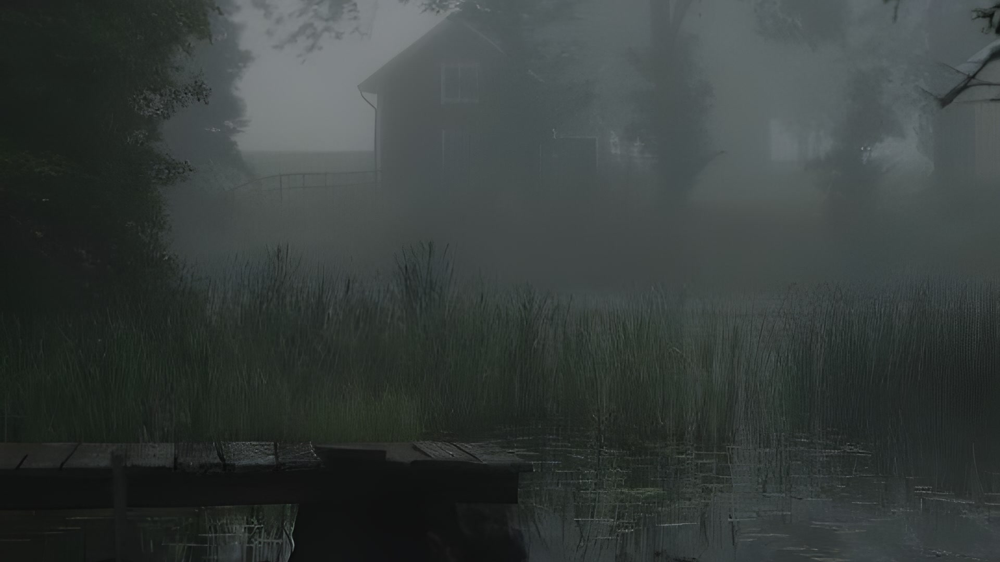

<div align="center">


# Obsession

### Око, которое смотрит на того, кто смотрит на тебя.

DPI-обход, ИИ-разблокировка и Telegram-прокси — в одном окне.


<br/>

[](https://github.com/Aizenssk-ss/VlarpSu/releases/latest)

<sub>Установщик ~22 МБ · Windows 10/11 · x64 · без зависимостей</sub>

</div>

---

## Что это

**Obsession** — десктоп-приложение для Windows, которое возвращает доступ к заблокированному: обходит DPI-фильтрацию (ТСПУ), открывает ИИ-сервисы и поднимает Telegram-прокси. Один экран, один клик, всё в комплекте — отдельные утилиты ставить не нужно.

А главное — если ТСПУ подстраивается, Obsession замечает это сам и молча чинит обход. Отсюда и имя.

---

## Установка

1. **Скачайте** [«Obsession Setup»](https://github.com/Aizenssk-ss/VlarpSu/releases/latest).
2. **Запустите** `Obsession-Setup_<версия>_x64.exe` — установщик проведёт через 4 шага (Аврора и глаз прилагаются).
3. **Запустите Obsession.** Защитный hotfix запускает интерфейс без постоянного запроса UAC.
4. **Готово.** Obsession живёт в трее — открывайте по клику на иконку-глаз.

> [!IMPORTANT]
> Защищённые возможности включаются независимо после preflight per-machine runtime. TgWsProxy работает локально из проверенной Program Files-установки; QR и доступ с телефона появляются только при доступном service-owned firewall lease.

---

## Возможности

| | Возможность | Детали |
|:--:|---|---|
| `net` | **Самовосстановление обхода** | Контур **Глаза → Менеджер сети → Мозг**: наблюдает за трафиком, распознаёт вмешательство ТСПУ и сам переподбирает рабочую стратегию под текущую сеть. → [как это работает](#самовосстановление-обхода) |
| `dpi` | **DPI-обход** | winws / Zapret. Категории Discord · YouTube/Twitch · Gaming · Universal. Выбор конфигов, тест и авто-подбор, рейтинг надёжности стратегий, лог в реальном времени. |
| `ai` | **ИИ-разблокировка** | ChatGPT, Claude, Gemini, Perplexity, Poe, HuggingFace, Midjourney через системный `hosts`. Провайдеры Malw / GeoHide, атомарная запись + бэкап + flushdns, авто-проверка обновлений. |
| `tg` | **Telegram-прокси** | MTProto-через-WebSocket в один клик (headless TgWsProxy). Ссылка `tg://proxy`, **QR для телефона** по LAN, пресеты Fake-TLS, диск-кэш CF-доменов. |
| `hub` | **Обзор** | Сетевая идентичность и сводный статус обхода / прокси / ИИ на одном экране. |
| `cfg` | **Профили и списки** | Наборы настроек и встроенный редактор доменных списков. |
| `ui` | **Темы и атмосфера** | Флагманская Obsession и живые WebGL2/Canvas-фоны. Темы Obsession · Aurora · Ophanim · Rain · Midnight и скрытые. → [галерея](#темы-и-атмосфера) |
| `sys` | **Система** | Динамическая иконка трея, нативные уведомления, тосты, кастомный титлбар, UAC-элевация, автозапуск, онбординг, персист настроек. |

---

## Самовосстановление обхода

ТСПУ не статичны — они подстраиваются. Поэтому обход в Obsession замкнут в петлю: приложение смотрит на собственный трафик, замечает, когда соединение начинают «резать», и меняет стратегию, пока канал снова не станет чистым. Нажимать ничего не нужно.

```text
 Глаза  ──▶  Менеджер сети  ──▶  Мозг  ──▶  чистый канал
 смотрит     ловит ТСПУ          чинит обход
 └────────────────────  ↻ повтор  ─────────────────────┘
```

---

## Темы и атмосфера

Визуальное лицо приложения — **Obsession: The Fixation**: угольно-чёрное оптическое стекло, жемчужный свет и глубокий кармин вокруг точки фиксации. Интерфейс использует живые фоны на голом WebGL2/Canvas 2D без внешних 3D-движков. Пять открытых тем (**Obsession · Aurora · Ophanim · Rain · Midnight**) и две скрытые (**Catnap · Fallen Down**), которые нужно найти. Для слабых машин есть режим «меньше анимаций».

<div align="center">
<table>
<tr>
<td align="center"><br/><sub><b>Rain</b></sub></td>
<td align="center"><br/><sub><b>Catnap</b> · скрытая</sub></td>
<td align="center"><br/><sub><b>Midnight</b></sub></td>
</tr>
</table>
<sub>Постеры выше — живые фоны тем, а не статичные экраны.</sub>
</div>

---

<details>
<summary><b>Для разработчиков — сборка из исходников</b></summary>

<br/>

Пользователю сборка не нужна — есть [инсталлер](#установка). Этот раздел для тех, кто хочет запустить проект из исходников.

### Стек


| Слой | Технологии |
|---|---|
| **Backend** | Rust · Tauri 2 · `tokio` · `reqwest` · `windows` · WinDivert |
| **Frontend** | React 18 · TypeScript · Vite · Tailwind CSS · Framer Motion · Zustand |
| **Графика** | Голый WebGL2 + Canvas 2D — собственный конвейер, без 3D-движков |

### Требования

[Node.js](https://nodejs.org/) 18+ · [Rust](https://www.rust-lang.org/tools/install) (stable) · [зависимости Tauri](https://tauri.app/start/prerequisites/) для вашей ОС.

### Запуск и сборка

```bash
cd ObsessionTauri
npm install
npm run tauri dev      # dev-режим с hot-reload
```

> [!WARNING]
> Приложение намеренно не запрашивает права администратора при старте. Привилегированные DPI/hosts/firewall-операции выполняет типизированная per-machine служба; недоступные capability остаются fail-closed независимо друг от друга.

```bash
npm run tauri build    # release + NSIS-инсталлятор; само приложение стартует без UAC
npm run build:setup    # фирменный установщик «Obsession Setup» → dist-release/
```

### Архитектура

```
ObsessionTauri/
├── src/                     React-фронтенд (Aurora Glass)
│   ├── screens/             Overview · Dpi · Ai · Telegram · Lists · Profiles · Settings
│   ├── store/               Zustand: dpi · hosts · proxy · lists · profile · log · theme · …
│   ├── design/              дизайн-токены, компоненты, WebGL2/Canvas-сцены тем
│   │   └── components/rain/ конвейер Rain: мир → капли/конденсат → композит
│   └── lib/tauri.ts         типизированный мост invoke + события
│
└── src-tauri/src/           Rust-бэкенд
    ├── dpi.rs               winws: spawn/kill, стрим лога, orphan, тест
    ├── eyes/                «Глаза» — наблюдатель трафика (WinDivert)
    ├── brain/               «Мозг» — авто-восстановление стратегии обхода
    ├── legacy_reliability/  надёжность Zapret1: оценка, Environment Gate, откат
    ├── adaptive_strategy/   подбор Strategy Pack для Zapret2 (типизированный DSL)
    ├── dpi_engine/          абстракция Zapret1/Zapret2 + манифесты паков
    ├── netcache.rs          рейтинг надёжности конфигов по сети
    ├── netid.rs             идентификация сети (MAC шлюза → ASN/регион)
    ├── hosts.rs             атомарная запись hosts + бэкап + провайдеры
    ├── proxy.rs             TgWsProxy + tg://proxy + LAN-форвардер + кэш доменов
    ├── profiles.rs          профили настроек
    ├── lists.rs             доменные списки
    ├── admin.rs             диагностическая проверка is_elevated
    ├── security.rs          fail-closed gate до защищённого helper/service
    ├── settings.rs          JSON-персист настроек
    ├── commands.rs          поверхность #[tauri::command]
    └── lib.rs               окно, трей, уведомления, shutdown-хук
```

Ресурсы (winws, WinDivert, TgWsProxy, конфиги, списки, иконки) лежат в `ObsessionTauri/src-tauri/resources/`, хешируются при сборке и устанавливаются machine-wide в `%ProgramFiles%\Obsession`.

</details>

---

<div align="center">
<sub>Сделано с одержимостью 👁️</sub>
</div>
