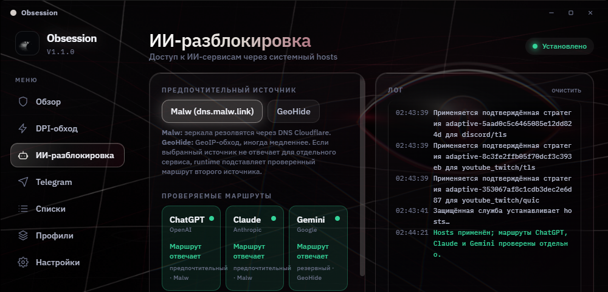
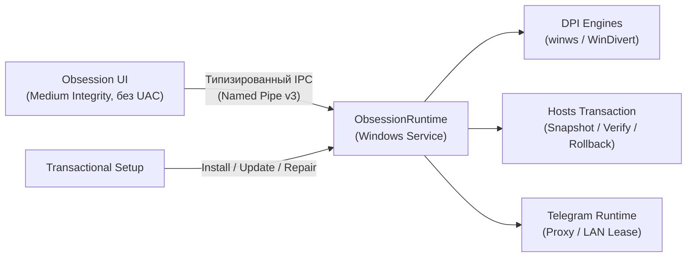
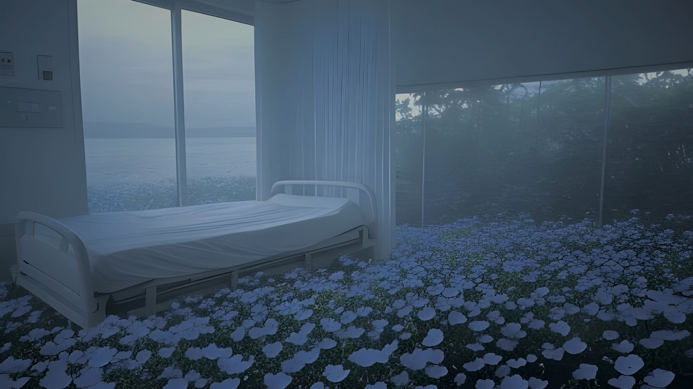

<div align="center">


# Obsession

### Сетевой набор для Windows — в одном живом интерфейсе

DPI-обход · проверяемые маршруты к ИИ · Telegram-прокси

<br />

<a href="https://github.com/AcediaWhy/Obsession/releases/latest"><strong>Скачать для Windows</strong></a>
&nbsp;&nbsp;·&nbsp;&nbsp;
<a href="#архитектура-и-возможности">Возможности</a>
&nbsp;&nbsp;·&nbsp;&nbsp;
<a href="#безопасность-и-модель-изоляции">Безопасность</a>
&nbsp;&nbsp;·&nbsp;&nbsp;
<a href="ObsessionTauri/README.md">Сборка</a>

<br />

<sub>Windows 10/11 · x64 · Rust + Tauri 2 · интерфейс без постоянного UAC · без телеметрии</sub>

</div>

---

<div align="center">
  
  <br />
  <sub>Obsession: The Black Choir · Gemini через Comss с резервом GeoHide, ChatGPT и Claude через Malw или GeoHide</sub>
</div>

## Концепция

**Obsession** объединяет инструменты восстановления сетевой связности в одном десктопном приложении для Windows. Оно управляет DPI-обходом, аккуратно устанавливает изолированные маршруты для поддерживаемых ИИ-сервисов и запускает встроенный Telegram-прокси.

Интерфейс приложения работает от имени обычного пользователя без административных привилегий. Все чувствительные сетевые операции выполняет изолированная системная служба с закрытым протоколом: передача произвольных исполняемых путей, команд оболочки или непроверенных параметров исключена на уровне архитектуры.

Obsession не является VPN: приложение не маскирует общий IP-адрес и не перенаправляет весь пользовательский трафик. Каждый модуль функционирует строго в пределах выбранной области.

---

## Архитектура и возможности

| Направление | Описание функциональности |
|---|---|
| **DPI-обход** | Движки Zapret Legacy и экспериментальный Zapret2. Раздельные категории для Discord, YouTube/Twitch, Gaming и Universal. Ручной выбор стратегий, активное тестирование и адаптивный автоподбор. |
| **Сенсорный контур** | Модуль наблюдения **Eyes** через WinDivert фиксирует состояние соединений (`Working` / `Reset` / `Blackhole`), различает сетевой фон от блокировки и предотвращает избыточный перебор стратегий при сбоях провайдера. |
| **ИИ-маршруты** | Проверка защищённых HTTPS-маршрутов к **ChatGPT, Claude и Gemini**. Автоматический выбор отвечающего шлюза (Comss, GeoHide, Malw). Все изменения `hosts` выполняются транзакционно с гарантированным откатом. |
| **Telegram Proxy** | Встроенный высокопроизводительный прокси `tgproxy-rs` на Rust (2.5 МБ). Протоколы Obf2 и FakeTLS, прямая ссылка `tg://proxy`, QR-код для мобильных клиентов и временный лизинг LAN-доступа через брандмауэр. |
| **Изоляция и списки** | Встроенные доменные каталоги, профили настроек, изоляция автохостов и независимое управление категориями. |
| **Первый запуск** | Onboarding V2: проверка системной готовности службы, формирование плана конфигурации, транзакционное применение и раздельная диагностика результатов. |
| **Визуальная система** | Аппаратно ускоренные сцены WebGL2 и Canvas 2D, адаптивный титлбар, трей, пять открытых тем оформления и режим пониженной анимации со статическими кадрами. |

> [!NOTE]
> «Маршрут отвечает» означает подтверждение защищённого TLS-рукопожатия с целевым узлом без передачи учетных данных, cookies и содержимого сессий.

---

## Безопасность и модель изоляции



- **Zero-Elevation UI**: интерфейс запускается в пользовательском сеансе и не требует прав администратора.
- **Fail-Closed RPC**: служба `ObsessionRuntime` принимает только строго валидированные enum-команды фиксированного размера (до 64 КБ).
- **Манифест ресурсов**: исполняемые компоненты и конфигурации устанавливаются в `%ProgramFiles%\Obsession` и проверяются по SHA-256 манифесту перед вызовом.
- **Транзакционный hosts**: изменение системного файла сопровождается пре-операционным снимком и верификацией; любой сбой инициирует автоматический откат.
- **Управление процессами**: процессы DPI закрепляются за Windows Job Objects и завершаются по точному дескриптору, исключая использование небезопасных системных утилит.
- **Конфиденциальность**: приложение не собирает аналитику, телеметрию и персональные данные.

Подробнее: [Архитектура защищённой службы](ObsessionTauri/docs/SECURE_RUNTIME_ARCHITECTURE.md) и [Onboarding V2](ObsessionTauri/docs/ONBOARDING_OVERHAUL_SPEC.md).

---

## Установка и запуск

1. Скачайте актуальный инсталлятор `Obsession-Setup_<версия>_x64.exe` в разделе [Releases](https://github.com/AcediaWhy/Obsession/releases/latest).
2. Запустите установщик и подтвердите запрос UAC (повышение прав требуется только системной службе при установке).
3. При первом старте мастер настройки поможет выбрать требуемые категории и проверит их доступность.

<details>
<summary><b>Проверка контрольной суммы (SHA-256)</b></summary>

Рядом с каждым релизом публикуется файл `.sha256`. Проверить целостность установщика можно через PowerShell:

```powershell
Get-FileHash .\Obsession-Setup_1.1.0_x64.exe -Algorithm SHA256
```
</details>

> [!WARNING]
> Установщик не содержит платной коммерческой подписи Authenticode. Windows SmartScreen может вывести предупреждение «Неизвестный издатель». Загружайте файлы исключительно со страницы релизов официального репозитория.

---

## Визуальные темы

Оформление строится вокруг глубоких темных тонов, векторной геометрии, оптического стекла и адаптивного фокуса.

Каталог включает темы **Obsession: The Black Choir**, **Aurora**, **Ophanim**, **Rain** и **Midnight**, а также скрытые темы, доступные через систему находок.

<div align="center">
<table>
<tr>
<td align="center"><br /><sub><b>Rain</b> · холодная комната у моря за дождевым стеклом</sub></td>
<td align="center"><br /><sub><b>Midnight</b> · ночной туман и мягкий свет</sub></td>
</tr>
</table>
</div>

---

## Ограничения текущей версии

- Поддерживаются только Windows 10/11 x64.
- Доступность DPI-стратегий и сторонних маршрутов зависит от провайдера, региона и текущего состояния внешней инфраструктуры.
- Zapret2 остаётся экспериментальным; Legacy — рекомендуемый стабильный движок.
- Доступ телефона к Telegram-прокси требует подходящей LAN-сети и доступной функции управления брандмауэром.
- README описывает текущую ветку разработки; опубликованная версия может отставать от неё.

---

## Разработка

Инструкции по сборке, устройству рабочих пространств, тестовым пакетам (1380+ тестов) и правилам расширения службы приведены в [руководстве разработчика](ObsessionTauri/README.md).

Стек технологий: **Rust · Tauri 2 · React 18 · TypeScript · Zustand · WebGL2 · Canvas 2D**

---

<div align="center">
<sub>Made by <b>AcediaWhy</b> · сделано с одержимостью</sub>
</div>
