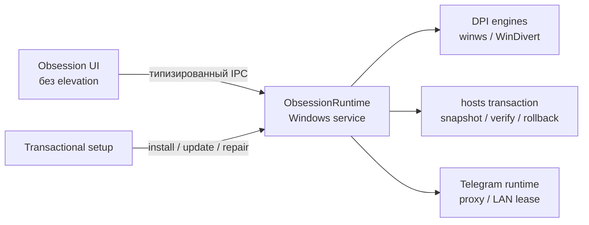

<div align="center">


# Obsession

### Сетевой набор для Windows — в одном живом интерфейсе

DPI-обход · проверяемые маршруты к ИИ · Telegram-прокси


<br />

[](https://github.com/AcediaWhy/Obsession/releases/latest)

<sub>Windows 10/11 · x64 · установщик около 32 МиБ · интерфейс работает без постоянного UAC</sub>

</div>

---

<div align="center">
  
  <br />
  <sub>Obsession: The Black Choir · Gemini через Comss с резервом GeoHide, ChatGPT и Claude через Malw или GeoHide</sub>
</div>

## Что такое Obsession

**Obsession** объединяет инструменты восстановления сетевой связности в одном приложении для Windows. Оно управляет DPI-обходом, аккуратно устанавливает маршруты для поддерживаемых ИИ-сервисов и запускает локальный Telegram-прокси.

Интерфейс не работает от имени администратора. Привилегированные операции выполняет отдельная защищённая служба с ограниченным протоколом: приложение не может передать ей произвольную команду, путь или URL.

Obsession — не VPN: приложение не скрывает IP-адрес и не перенаправляет весь трафик. Каждый механизм действует только в своей выбранной области.

## Возможности

| Направление | Что умеет Obsession |
|---|---|
| **DPI-обход** | Zapret Legacy и экспериментальный Zapret2, отдельные категории Discord, YouTube/Twitch, Gaming и Universal, ручной выбор конфигурации, тестирование и автоподбор. |
| **Надёжность** | Запоминает подтверждённую конфигурацию для текущей сети, оценивает состояние категорий и может последовательно проверить альтернативные стратегии. |
| **ИИ-сервисы** | Отдельно проверяет HTTPS-маршруты к **ChatGPT, Claude и Gemini**. Для ChatGPT и Claude выбирается отвечающий маршрут Malw или GeoHide; Gemini использует Comss с автоматическим резервом через GeoHide. Фоновая проверка не изменяет `hosts`. |
| **Telegram** | Встроенный прокси `tgproxy-rs`, написанный на Rust, ссылка `tg://proxy`, QR-код с прямым открытием клиента и опциональный доступ телефона по LAN через временное правило брандмауэра. Прямое соединение с Telegram используется по умолчанию. |
| **Профили и списки** | Профили настроек, встроенные доменные списки и раздельное управление категориями обхода. |
| **Первый запуск** | Onboarding V2 проверяет готовность установленной службы, строит план выбранных функций, применяет его транзакционно и показывает раздельный результат проверки. |
| **Интерфейс** | Трей, уведомления, собственный титлбар, режим уменьшенной анимации и пять открытых тем с WebGL2/Canvas-сценами и выразительными статичными fallback-кадрами. |

> [!NOTE]
> «Маршрут отвечает» означает успешное защищённое соединение без аккаунта, cookies и доступа к содержимому переписки. Это не обещание работоспособности каждой функции стороннего сервиса.

## Установка

1. Скачайте последний `Obsession-Setup_<версия>_x64.exe` на странице [Releases](https://github.com/AcediaWhy/Obsession/releases/latest).
2. При обновлении или восстановлении полностью выйдите из уже запущенной Obsession через меню трея. Установщик не перезаписывает занятые файлы молча.
3. Запустите установщик и подтвердите UAC. Повышение прав требуется установщику и системной службе, но не обычному интерфейсу.
4. После первого запуска выберите нужные функции в мастере настройки и дождитесь раздельной проверки результатов.

> [!WARNING]
> Установщик пока не подписан платным Authenticode-сертификатом. Windows SmartScreen может показать предупреждение «Неизвестный издатель». Скачивайте файл только из раздела Releases этого репозитория и сверяйте SHA-256.

Рядом с установщиком публикуется файл `.sha256`. Проверить загрузку можно в PowerShell:

```powershell
Get-FileHash .\Obsession-Setup_1.1.0_x64.exe -Algorithm SHA256
```

## Как устроена защищённая часть



- UI остаётся в пользовательской сессии и не получает административный токен.
- Служба принимает только заранее определённые операции и проверяет совместимость версии протокола.
- Бинарные ресурсы и конфигурации устанавливаются в `%ProgramFiles%\Obsession` и сверяются с манифестом.
- Изменение `hosts` выполняется через точный снимок, проверку сети, атомарную запись и повторную проверку; неожиданный сбой возвращает предыдущий файл.
- Установщик поддерживает установку, обновление, восстановление и откат. Технические подробности пишутся в локальный журнал.
- Удалённая телеметрия не используется.

Подробнее: [архитектура защищённой службы](ObsessionTauri/docs/SECURE_RUNTIME_ARCHITECTURE.md) и [Onboarding V2](ObsessionTauri/docs/ONBOARDING_OVERHAUL_SPEC.md).

## Визуальная система

Основная тема **Obsession: The Black Choir** строится из многослойной векторной гравировки, оптического стекла, карминовой глубины и глаз, скрытых в общей геометрии. Состояние сцены связано с реальной активностью приложения, но не заменяет текстовые и цветовые индикаторы.

Открытый каталог также включает **Aurora, Ophanim, Rain и Midnight**. В приложении есть необязательные скрытые находки — README намеренно не раскрывает их названия и способ открытия.

<div align="center">
<table>
<tr>
<td align="center"><br /><sub><b>Rain</b> · холодная комната у моря за дождевым стеклом</sub></td>
<td align="center"><br /><sub><b>Midnight</b> · ночной туман и мягкий свет</sub></td>
</tr>
</table>
</div>

## Ограничения текущей версии

- Поддерживаются только Windows 10/11 x64.
- Доступность DPI-стратегий и сторонних маршрутов зависит от провайдера, региона и текущего состояния внешней инфраструктуры.
- Zapret2 остаётся экспериментальным; Legacy — рекомендуемый стабильный движок.
- Доступ телефона к Telegram-прокси требует подходящей LAN-сети и доступной функции управления брандмауэром.
- README описывает текущую ветку разработки; опубликованная версия может отставать от неё.

## Разработка

Команды сборки, устройство workspace, тестовые наборы и правила работы с защищённой службой находятся в [руководстве разработчика](ObsessionTauri/README.md).

Ключевые технологии: **Rust · Tauri 2 · React 18 · TypeScript · Zustand · WebGL2 · Canvas 2D**.

---

<div align="center">
<sub>Made by <b>AcediaWhy</b> · сделано с одержимостью</sub>
</div>
