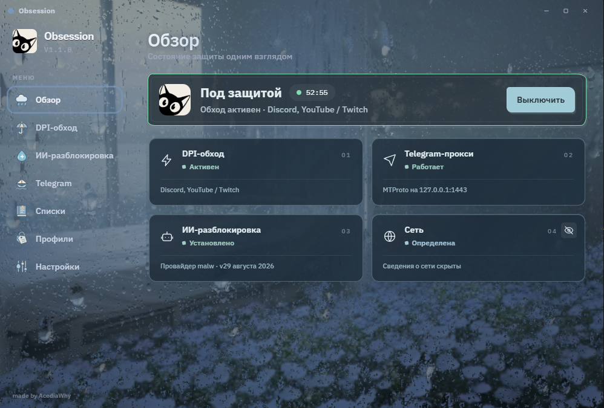
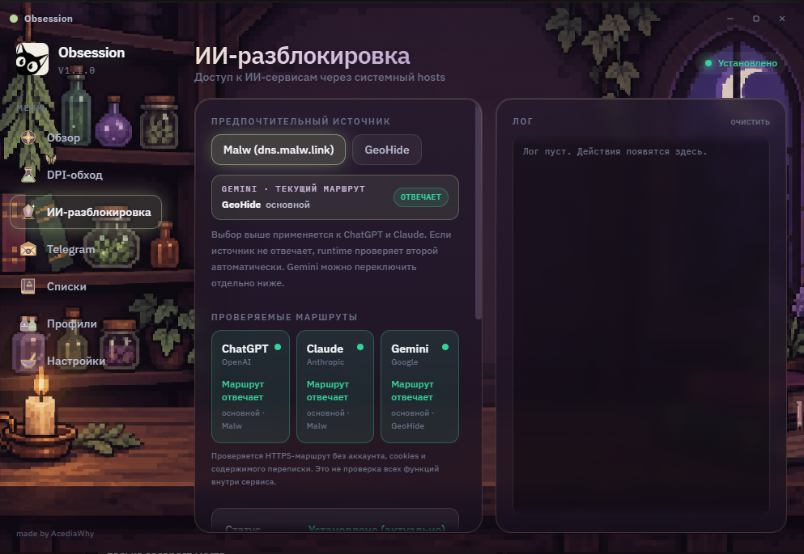

<div align="center">


# Obsession

Приложение для Windows с DPI-обходом, Telegram-прокси и доступом к ИИ-сервисам.

**[Скачать для Windows](https://github.com/AcediaWhy/Obsession/releases/latest)** · [Установка](#start) · [Оформление](#themes) · [Помощь](#help) · [Документация](ObsessionTauri/docs/README.md) · [Разработчикам](ObsessionTauri/README.md)

<sub>Windows 10/11 · x64</sub>

</div>



<sub>Тема Rain. Сведения о сети скрыты кнопкой с глазом на карточке «Сеть».</sub>

Obsession помогает настроить доступ к Discord, YouTube, Twitch и другим сервисам. В приложении можно подобрать конфигурацию обхода, подключить Telegram через встроенный прокси и проверить маршруты к ChatGPT, Claude и Gemini. Состояние всех модулей видно на главном экране.

Настройки можно подбирать автоматически или менять вручную. Рабочие сочетания удобно сохранять в профили, чтобы не настраивать всё заново при смене сети.

## Возможности

| Раздел | Возможности |
|---|---|
| **DPI-обход** | Движки Zapret Legacy и Zapret2. Отдельные настройки для Discord, YouTube/Twitch, Gaming и Universal, проверка конфигураций и автоподбор. |
| **Telegram** | Встроенный прокси на Rust. Подключение по ссылке или QR-коду, доступ с телефона в локальной сети. |
| **ИИ-разблокировка** | Маршруты к ChatGPT, Claude и Gemini через сторонние шлюзы. Malw или GeoHide для ChatGPT и Claude, отдельный выбор маршрута для Gemini. |
| **Списки и профили** | Редактирование списков и сохранение наборов настроек для разных сетей и задач. |
| **Темы** | Восемь вариантов оформления с собственными сценами, иконками и эффектами карточек при наведении. |

<details>
<summary>Экран ИИ-разблокировки</summary>



</details>

Работа обхода зависит от сети и провайдера. Obsession не скрывает общий IP-адрес компьютера и не направляет весь трафик через VPN. ИИ-маршруты зависят от доступности сторонних шлюзов; подписки и ограничения аккаунтов остаются прежними.

<a id="start"></a>

## Установка

1. Скачайте `Obsession-Setup_<версия>_x64.exe` из [последнего релиза](https://github.com/AcediaWhy/Obsession/releases/latest).
2. Запустите установщик и подтвердите запрос Windows на установку приложения и службы.
3. Откройте Obsession: приложение сразу показывает «Обзор» со статусами модулей.
4. Выберите нужные сервисы, подберите конфигурацию и проверьте её в браузере или приложении.

Obsession устанавливается в `%ProgramFiles%\Obsession`. Для обычного запуска права администратора не нужны. Если на компьютере нет WebView2, установщик предложит загрузить его с сайта Microsoft. Обновление и восстановление выполняются тем же установщиком.

README описывает текущую версию исходников. Перед установкой проверьте описание релиза: опубликованная сборка может содержать не все перечисленные изменения.

<details>
<summary>Проверка файла установщика</summary>

В PowerShell откройте папку со скачанным файлом и выполните команду, указав имя своей версии:

```powershell
Get-FileHash .\Obsession-Setup_1.1.0_x64.exe -Algorithm SHA256
```

Сравните результат с файлом `.sha256`, если он приложен к релизу. Совпадение означает, что контрольная сумма скачанного файла соответствует опубликованной.

</details>

<a id="themes"></a>

## Оформление

В настройках доступны Golden Meadow, Aurora, Alchemist, Rain и Midnight. Ещё три темы скрыты в приложении и открываются по мере знакомства с ним. У каждой темы своя сцена: осеннее поле, комната под дождём, ночной туман или мастерская алхимика. На главном скриншоте показана Rain, на экране ИИ — Alchemist.

Карточки обзора реагируют на движение указателя; их оформление и эффекты меняются вместе с темой. Анимация изменения статуса плавно подчёркивает включение и выключение модулей. Сведения о текущей сети можно скрыть кнопкой с глазом на карточке «Сеть» — удобно перед снимком экрана. Выбор сохраняется после перезапуска.

Анимацию можно уменьшить в настройках. При сворачивании в трей приложение приостанавливает визуальные эффекты; сетевые модули продолжают работать.

<a id="help"></a>

## Если что-то не работает

Конфигурация, которая подошла одному провайдеру, может не подойти другому. Начните с автоподбора. Если результат не устраивает, попробуйте выбрать конфигурацию вручную. Номер в имени файла не означает, что этот вариант быстрее остальных.

Встроенная проверка показывает доступность отдельных адресов, время ответа и ошибки. После неё стоит проверить свой обычный сценарий: открыть видео, загрузить файл или подключиться к голосовому каналу.

<details>
<summary>Сайт открывается, но видео, файлы или голосовая связь работают плохо</summary>

Страницы и медиа часто загружаются с разных адресов. Проверьте другую конфигурацию именно на той задаче, с которой возникли проблемы. На время сравнения остановите другие программы обхода, чтобы они не мешали проверке.

В Legacy для Discord и YouTube можно выбрать разные конфигурации. Приложение объединит выбранные категории в один процесс обхода.

[Подробнее о конфигурациях Discord](ObsessionTauri/docs/DIAGNOSTICS.md#конфигурации-discord)

</details>

<details>
<summary>Автоподбор не нашёл рабочую конфигурацию</summary>

Откройте подробности проверки и посмотрите, какие адреса не ответили. Если ни один кандидат не прошёл проверку полностью, приложение сохранит предыдущий выбор. Конфигурацию можно сменить вручную.

[Как читать результаты проверки](ObsessionTauri/docs/DIAGNOSTICS.md#результаты-проверки-dpi)

</details>

<details>
<summary>Служба недоступна или обход не включается</summary>

Запустите актуальный установщик и восстановите установку. Для сетевых функций нужна совместимая служба ObsessionRuntime, поэтому обновлять приложение следует через Setup. Копирования нового EXE недостаточно.

</details>

Если проблема повторяется, [создайте issue](https://github.com/AcediaWhy/Obsession/issues). Укажите версию Obsession, провайдера, выбранный движок и конфигурацию. Опишите, что ожидали и что произошло, приложите результаты проверки. Перед отправкой журнала удалите секрет прокси и личные данные.

## Удаление

Найдите Obsession в списке установленных приложений Windows и выберите «Удалить». В деинсталляторе можно сохранить настройки для повторной установки или удалить их вместе с профилями, кэшем и журналами.

Приложение и служба удаляются в обоих случаях. Общий WebView2, экспортированные файлы и скачанные вручную установщики сохраняются. Если какие-то файлы заняты, деинсталлятор сообщит об этом. Удалённые настройки восстановить нельзя.

[Подробности удаления и границы очистки](ObsessionTauri/installer/UNINSTALL.md)

## Разработка и компоненты

Интерфейс написан на React и TypeScript, приложение и Windows-служба используют Rust и Tauri 2. Служба ObsessionRuntime выполняет операции, которым нужны системные права: запускает сетевые компоненты, меняет управляемые записи `hosts` и настраивает доступ к прокси через брандмауэр.

[Руководство разработчика](ObsessionTauri/README.md) содержит команды запуска, тестирования и сборки. Устройство службы описано в [документации по архитектуре](ObsessionTauri/docs/SECURE_RUNTIME_ARCHITECTURE.md).

В проекте используются сторонние компоненты и конфигурации. Их источники и лицензии:

- [Zapret2: исходная версия, патчи и сборка](ObsessionTauri/third-party/zapret2/README.md).
- [Flowseal: версия адаптированного набора](ObsessionTauri/third-party/flowseal/legacy-1.10.3.lock.json).
- [Лицензии поставляемых компонентов](ObsessionTauri/src-tauri/resources/licenses).
- [Встроенный Telegram-прокси](tgproxy-rs/README.md).

---

<div align="center">
<sub>Автор проекта: <a href="https://github.com/AcediaWhy">AcediaWhy</a></sub>
</div>
